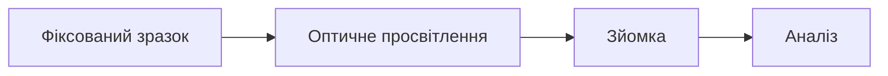
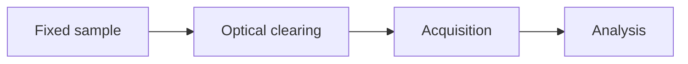

# FIL — Fluorescence Imaging Laboratory

Вебсайт лабораторії флуоресцентної візуалізації.
Website of the Fluorescence Imaging Laboratory.

🌐 **Live site:** [https://fluoimlab.github.io](https://fluoimlab.github.io)

| | |
|---|---|
| 🇺🇦 | **[Інструкція українською](#-інструкція-українською)** |
| 🇬🇧 | **[Instructions in English](#-instructions-in-english)** |

Сайт складається зі статичних файлів: HTML, CSS, JavaScript і текстових файлів
Markdown. Немає ані бази даних, ані процесу збірки — GitHub Pages віддає файли
такими, якими вони лежать у репозиторії.
**Щоб змінити сайт, достатньо відредагувати текстовий файл `.md`.**

The site is made of static files: HTML, CSS, JavaScript and Markdown text files.
There is no database and no build step — GitHub Pages serves the files exactly as
they are stored in the repository.
**To change the website you only need to edit a `.md` text file.**

---
---

# 🇺🇦 Інструкція українською

## Зміст

1. [Структура проєкту](#1-структура-проєкту)
2. [Локальний перегляд сайту](#2-локальний-перегляд-сайту)
3. [Як опублікувати зміни](#3-як-опублікувати-зміни)
4. [Як редагувати текст](#4-як-редагувати-текст)
5. [Як змінювати зображення](#5-як-змінювати-зображення)
6. [Шапка сторінки та велике фонове зображення](#6-шапка-сторінки-та-велике-фонове-зображення)
7. [Готові блоки оформлення](#7-готові-блоки-оформлення)
   - [7а. Окремі сторінки для карток](#7а-окремі-сторінки-для-карток)
   - [7б. Блог](#7б-блог)
   - [7в. Формули та діаграми](#7в-формули-та-діаграми)
8. [Меню, підвал і загальні налаштування](#8-меню-підвал-і-загальні-налаштування)
9. [Юридичні документи та PDF-файли](#9-юридичні-документи-та-pdf-файли)
10. [Банер підтримки України](#10-банер-підтримки-україни)
11. [Як додати нову сторінку](#11-як-додати-нову-сторінку)
12. [Як змінити кольори та шрифти](#12-як-змінити-кольори-та-шрифти)
13. [Довідка з Markdown](#13-довідка-з-markdown)
14. [Якщо щось пішло не так](#14-якщо-щось-пішло-не-так)

---

## 1. Структура проєкту

```
fluoimlab.github.io/
├── .nojekyll             ← Порожній службовий файл. Не видаляти!
├── index.html            ← Каркас сайту. Редагувати не потрібно.
├── style.css             ← Оформлення: кольори, шрифти, відступи.
├── script.js             ← Логіка сайту. Редагувати не потрібно.
│
├── site/                 ← ЗАГАЛЬНІ НАЛАШТУВАННЯ
│   ├── settings_uk.md    ← назва, меню, підвал, логотипи (українською)
│   ├── settings_en.md    ← те саме англійською
│   └── img/              ← логотипи установ у підвалі
│
├── about/                ← ГОЛОВНА СТОРІНКА
│   ├── content_uk.md     ← текст українською
│   ├── content_en.md     ← текст англійською
│   └── img/              ← зображення цієї сторінки
│
├── research/             ← НАУКОВА РОБОТА
│   ├── content_uk.md     ← перелік проєктів і публікацій
│   ├── project-1_uk.md   ← окрема сторінка проєкту
│   └── img/
│
├── facility/             ← ОБЛАДНАННЯ ТА ПОСЛУГИ
│   ├── content_uk.md     ← перелік систем і послуг
│   ├── confocal_uk.md    ← окрема сторінка системи
│   └── img/
│
├── protocols/            ← ПРОТОКОЛИ
│   ├── content_uk.md     ← перелік протоколів
│   ├── protocol-1_uk.md  ← окрема сторінка протоколу
│   └── img/
│
├── blog/                 ← БЛОГ
│   ├── content_uk.md     ← перелік дописів
│   ├── 2026-03-…_uk.md   ← текст окремого допису
│   └── img/
│
├── team/                 ← КОЛЕКТИВ
├── events/               ← ЗАХОДИ
│
├── legal/                ← ЮРИДИЧНІ ДОКУМЕНТИ
│   ├── content_uk.md
│   ├── content_en.md
│   └── docs/             ← PDF-файли для завантаження
│
├── support/              ← ПІДТРИМКА УКРАЇНИ
│   ├── content_uk.md
│   ├── content_en.md
│   └── banner_en.md      ← банер на головній сторінці
│
└── assets/
    ├── logo.png          ← логотип у шапці сайту
    ├── marked.min.js     ← бібліотека для читання Markdown
    ├── mermaid.min.js    ← бібліотека для діаграм
    └── katex/            ← бібліотека для формул LaTeX
```

**Головне правило:** одна тека = один розділ сайту. У кожній теці лежать два
файли з текстом (`content_uk.md` і `content_en.md`) та тека `img/` з
зображеннями цього розділу.

**Другий принцип:** у теці розділу можуть лежати **окремі сторінки** —
детальний опис приладу, сторінка проєкту, текст допису в блозі. Такий файл
називається `назва_uk.md` / `назва_en.md` і відкривається за адресою
`#тека/назва`. Зображення для нього беруться з тієї самої теки `img/`.

---

## 2. Локальний перегляд сайту

Перед публікацією зміни варто переглянути на своєму комп'ютері.
Просто відкрити `index.html` подвійним кліком **не вийде** — браузер із
міркувань безпеки забороняє локальній сторінці читати файли `.md`.
Потрібен простий локальний сервер (він запускається однією командою і нічого
не встановлює у систему).

### Спосіб 1 — Python (є на macOS і Linux одразу)

Відкрийте термінал, перейдіть до теки сайту та виконайте:

```bash
python3 -m http.server 8000
```

Потім відкрийте у браузері адресу **http://localhost:8000**

Щоб зупинити сервер — натисніть `Ctrl + C` у терміналі.

### Спосіб 2 — Node.js

```bash
npx -y serve .
```

### Спосіб 3 — Visual Studio Code

Установіть розширення **Live Server**, після чого натисніть правою кнопкою на
`index.html` → **Open with Live Server**.

### Важливо: браузер кешує оформлення та логіку

Текстові файли `.md` сайт завжди завантажує наново, тому зміни в контенті
з'являються одразу після оновлення сторінки.

А от `style.css` і `script.js` браузер запам'ятовує. Якщо ви (або хтось для
вас) змінили один із цих двох файлів, а сайт поводиться по-старому — треба
підказати браузерам, що файл новий. Для цього у файлі `index.html` є номер
версії:

```html
<link rel="stylesheet" href="style.css?v=3">
<script src="script.js?v=3"></script>
```

**Збільште число на одиницю** в обох рядках (`?v=3`) — і всі браузери
завантажать нові файли. Робити це потрібно **лише** після зміни `style.css`
або `script.js`; для редагування контенту — ні.

Для швидкої перевірки на своєму комп'ютері вистачить оновлення без кешу:
**Ctrl + Shift + R** (на macOS **Cmd + Shift + R**).

---

## 3. Як опублікувати зміни

### Найпростіший спосіб — просто у браузері, на GitHub

1. Відкрийте репозиторій на GitHub.
2. Перейдіть до потрібного файлу, наприклад `team/content_uk.md`.
3. Натисніть іконку олівця ✏️ (**Edit this file**).
4. Внесіть зміни.
5. Унизу натисніть зелену кнопку **Commit changes**.
6. Через 1–2 хвилини сайт оновиться автоматично.

### Якщо ви працюєте з файлами на комп'ютері

```bash
git add .
git commit -m "Оновив сторінку колективу"
git push origin main
```

### Перше налаштування GitHub Pages (робиться один раз)

1. У репозиторії відкрийте **Settings** → **Pages**.
2. У розділі **Source** оберіть гілку `main` і теку `/ (root)`.
3. Натисніть **Save**.
4. Через 1–2 хвилини сайт буде доступний за адресою репозиторію.

> ⚠️ **У корені проєкту має лежати порожній файл `.nojekyll`.** Без нього
> GitHub Pages запускає Jekyll, який перетворює всі файли `.md` на `.html` —
> і сайт не може їх прочитати. Виглядає це так: сторінка відкривається, але
> замість вмісту показує «Сторінку не знайдено», а меню зникає. Файл уже є в
> репозиторії; не видаляйте його.

---

## 4. Як редагувати текст

Увесь текст сайту лежить у файлах `content_uk.md` (українською) та
`content_en.md` (англійською).

| Сторінка сайту | Файл українською | Файл англійською |
|----------------|------------------|------------------|
| Головна | `about/content_uk.md` | `about/content_en.md` |
| Наукова робота | `research/content_uk.md` | `research/content_en.md` |
| Обладнання та послуги | `facility/content_uk.md` | `facility/content_en.md` |
| Колектив | `team/content_uk.md` | `team/content_en.md` |
| Заходи | `events/content_uk.md` | `events/content_en.md` |
| Протоколи | `protocols/content_uk.md` | `protocols/content_en.md` |
| Блог | `blog/content_uk.md` | `blog/content_en.md` |
| Юридичні документи | `legal/content_uk.md` | `legal/content_en.md` |
| Підтримати Україну | `support/content_uk.md` | `support/content_en.md` |

> **Українська та англійська версії — це два незалежні файли.**
> Якщо ви змінили текст в українському файлі, не забудьте внести ту саму зміну
> в англійський (і навпаки).

Редагувати ці файли можна будь-яким текстовим редактором: Блокнот, TextEdit,
Notepad++, VS Code або прямо у вікні GitHub.

### Що таке Markdown

Це звичайний текст із кількома простими позначками:

```markdown
## Заголовок розділу

Звичайний абзац тексту. **Жирний текст**, *курсив*.

- пункт списку
- ще один пункт

[Текст посилання](https://example.com)
```

Повна довідка — у [розділі 13](#13-довідка-з-markdown).

### Коментарі для редактора

Рядки виду `<!-- ... -->` — це підказки для того, хто редагує файл.
На сайті вони **не відображаються**. Ви можете їх залишати або видаляти.

---

## 5. Як змінювати зображення

### Крок 1. Покладіть файл у теку `img/` потрібної сторінки

Наприклад, фотографію мікроскопа — у теку `facility/img/`.

**Вимоги до файлів:**

| Параметр | Рекомендація |
|----------|--------------|
| Формат | `.jpg`, `.png`, `.webp`, `.svg` |
| Ширина | 1200–1600 пікселів для великих зображень, 600–900 для карток |
| Розмір файлу | бажано до 500 КБ (стисніть, наприклад, на squoosh.app) |
| Назва файлу | лише латинські літери, цифри, `-` та `_`, **без пробілів** |

Приклад правильної назви: `stellaris-8.jpg`
Приклад неправильної: `Мікроскоп Стелларіс 8.JPG`

### Крок 2. Впишіть назву файлу в текстовий файл сторінки

Шлях завжди пишеться **відносно теки сторінки**, тобто починається з `img/`.

**Зображення всередині тексту:**

```markdown

```

**Зображення в картці, у профілі людини, у галереї** — через рядок `image:`
(див. [розділ 7](#7-готові-блоки-оформлення)):

```
### Конфокальний мікроскоп
image: img/stellaris-8.jpg
```

**Велике фонове зображення сторінки** — через рядок `hero_image:`
у «шапці» файлу (див. [розділ 6](#6-шапка-сторінки-та-велике-фонове-зображення)).

### Крок 3. Щоб замінити зображення

Найпростіше — завантажте новий файл **з такою самою назвою** поверх старого.
Тоді у текстових файлах нічого міняти не треба.

### Логотип сайту

Логотип у шапці та іконка вкладки браузера — це файл `assets/logo.png`.
Замініть його своїм зображенням із такою самою назвою (квадратне, приблизно
512×512 пікселів).

Щоб **прибрати логотип із шапки**, залиште порожнім рядок `logo:` у файлах
`site/settings_uk.md` і `site/settings_en.md` — див.
[розділ 8](#8-меню-підвал-і-загальні-налаштування).

Логотипи установ, до складу яких входить лабораторія, лежать у теці
`site/img/` і теж описані в [розділі 8](#8-меню-підвал-і-загальні-налаштування).

### Зображення-заготовки

Файли `.svg` у теках `img/` — це умовні заготовки, які постачаються разом із
шаблоном. Замінюйте їх справжніми фотографіями та мікрофотографіями.

---

## 6. Шапка сторінки та велике фонове зображення

На початку кожного файлу `content_*.md` є блок між двома лініями `---`.
Це «шапка» сторінки:

```
---
eyebrow: Лабораторія флуоресцентної візуалізації
title: Освітлюючи матрицю життя
subtitle: Короткий опис сторінки у 1–2 реченнях.
hero_image: img/hero.svg
hero_alt: Опис зображення для незрячих
hero_caption: Підпис під зображенням
---
```

| Рядок | Що робить | Обов'язковий |
|-------|-----------|--------------|
| `eyebrow` | маленький надпис над заголовком | ні |
| `title` | великий заголовок сторінки | так |
| `subtitle` | текст під заголовком | ні |
| `hero_image` | велике фонове зображення на всю ширину | ні |
| `hero_alt` | опис зображення для програм читання з екрана | ні |
| `hero_caption` | дрібний підпис під зображенням | ні |

**Якщо прибрати рядок `hero_image`** — сторінка отримає звичайну компактну
шапку без картинки (так зроблено на всіх сторінках, крім головної).

> ⚠️ Не видаляйте лінії `---` на початку файлу і не ставте зайвих пробілів
> перед назвою рядка. Двокрапка після назви — обов'язкова.

---

## 7. Готові блоки оформлення

Щоб текст виглядав як картки, календар подій чи список публікацій, у файлі
використовуються **блоки**. Блок починається рядком `:::назва` і закінчується
рядком `:::`

```
:::cards
   ... вміст блоку ...
:::
```

**Одне правило для всіх блоків:**
кожен рядок `### Назва` починає новий елемент;
рядки одразу під ним виду `властивість: значення` задають його параметри;
далі йде звичайний текст Markdown — опис елемента.

Нижче — усі доступні блоки. Найпростіший спосіб додати новий елемент —
скопіювати сусідній і змінити текст.

### `:::metrics` — великі числа

```
:::metrics
### 15+
Методів візуалізації

### 50 нм
Роздільна здатність
:::
```

### `:::cards` — картки (обладнання, послуги, проєкти)

```
:::cards
### Назва картки
tag: Мітка
image: img/photo.jpg
meta: Дрібний рядок під заголовком
page: detail-page

Опис картки. Можна використовувати **жирний текст**, списки тощо.
:::
```

| Властивість | Призначення |
|-------------|-------------|
| `tag` | коротка мітка над заголовком |
| `image` | зображення картки |
| `meta` | дрібний рядок під заголовком |
| `page` | назва файлу з окремою сторінкою (див. [розділ 7а](#7а-окремі-сторінки-для-карток)) |
| `link` | зовнішня адреса, якщо окрема сторінка не потрібна |
| `link_label` | текст посилання внизу картки |

Якщо вказано `page:` або `link:`, **уся картка стає клікабельною**.

**Два формати карток.** Блок можна відкрити двома способами:

| Запис | Як виглядає |
|-------|-------------|
| `:::cards` | сітка: три картки в ряд (на вузькому екрані менше) |
| `:::cards wide` | кожна картка на всю ширину сторінки: зображення ліворуч, текст праворуч |

```
:::cards wide
### Назва картки
image: img/photo.jpg
page: detail-page

Опис картки.
:::
```

В обох форматах клік по картці веде на ту саму сторінку. Широкий формат
доречний, коли карток небагато й опис довший; сітка — коли карток багато.
Картка без рядка `image:` у широкому форматі займає всю ширину текстом.

**Висота карток однакова** і не залежить від пропорцій зображення: картинка
вписується у прямокутник зі сталим співвідношенням сторін (16:10) і при потребі
обрізається по центру. Тому квадратне фото і витягнутий кадр дають панелі
однакової висоти. Якщо потрібне інше співвідношення, додайте рядок до «шапки»
сторінки:

```
card_media_ratio: 3 / 2
```

### `:::people` — колектив

```
:::people
### Ім'я Прізвище
role: Керівник лабораторії
specialty: Науковий ступінь · спеціалізація
image: img/photo.jpg
size: 7rem
email: name@lab.org
orcid: https://orcid.org/0000-0000-0000-0000
scholar: https://scholar.google.com/...
website: https://...
github: https://github.com/...

Коротка біографічна довідка.
:::
```

Якщо рядка `image:` немає, замість фото буде показано ініціали.

**Розмір фотографій.** Фото завжди **квадратне**: зображення обрізається по
центру, тож підійде будь-який вихідний файл — і горизонтальний, і
вертикальний. Розмір задається в двох місцях:

| Де | Що робить |
|----|-----------|
| `portrait_size: 7rem` у «шапці» сторінки | розмір усіх фотографій на сторінці (типово 5.5rem) |
| `size: 9rem` у записі людини | розмір фото саме цієї людини |

Розмір, як і всюди, можна писати як `7rem`, `96px` або просто числом `96`.

> Для гарної якості беріть квадратні фото зі стороною щонайменше 400 пікселів.
> Фотографії показуються в кольорі, як у вихідному файлі.

### `:::events` — календар заходів

```
:::events
### Назва заходу
date: 2026-10-14
time: 10:00 – 17:00
location: Аудиторія 12
format: Очно
organizer: Ім'я організатора
audience: Аспіранти та дослідники
status: open
link: https://example.com/registration
link_label: Реєстрація

Опис заходу.
:::
```

`date` пишеться **у форматі РРРР-ММ-ДД** — тоді ліворуч з'явиться плашка з
місяцем, числом і роком. Якщо формат інший, дата буде показана як звичайний текст.

Можливі значення `status`:

| Значення | Як показується | Колір |
|----------|----------------|-------|
| `open` | ВІДКРИТА РЕЄСТРАЦІЯ | зелений |
| `waitlist` | ЛИСТ ОЧІКУВАННЯ | рожевий |
| `full` | МІСЦЬ НЕМАЄ | червоний |
| `closed` | РЕЄСТРАЦІЮ ЗАКРИТО | червоний |
| `past` | ЗАВЕРШЕНО | сірий |
| `online` | ОНЛАЙН | бірюзовий |

Свій власний напис можна задати рядком `status_label: Будь-який текст`.

### `:::publications` — публікації

```
:::publications
### Назва статті
authors: Прізвище І., Прізвище І.
journal: Nature Methods
volume: 21(4), 123–130
year: 2025
doi: 10.1038/s41592-000-0000-0
url: https://...
pdf: img/preprint.pdf
image: img/thumbnail.jpg
tag: Кальцієва візуалізація

Короткий опис (необов'язково).
:::
```

`doi` можна писати як номер (`10.1038/...`) або як повне посилання — обидва
варіанти працюють.

### `:::figures` — ілюстрації з підписом і джерелом

Блок для наукових ілюстрацій: схем, графіків, рисунків зі статей. На відміну
від галерей, ілюстрація **ніколи не обрізається** — зображення показується
цілком, а під ним стоїть підпис і посилання на джерело.

```
:::figures
### Рис. 1 — Функція розсіювання точки
image: img/psf.png
source: https://doi.org/10.0000/example
source_label: Nature Methods, 2024

Підпис до ілюстрації. Можна писати кілька речень і використовувати
**жирний текст**.
:::
```

| Властивість | Призначення |
|-------------|-------------|
| `image` | файл ілюстрації (обов'язково) |
| `source` | адреса джерела; стає посиланням у підписі |
| `source_label` | як назвати джерело; без нього показується домен |
| `link` | окрема адреса, яка відкриється після кліку на саму ілюстрацію |
| `ratio` | співвідношення рамки, наприклад `1/1` або `4/3` |
| `alt` | опис для програм читання з екрана; без нього береться заголовок |

Заголовок після `###` стає назвою ілюстрації, текст під властивостями —
підписом.

**Кілька ілюстрацій у ряд.** Додайте після назви блоку число `2` або `3`:

```
:::figures 2
### Ліва ілюстрація
image: img/left.png

Підпис.

### Права ілюстрація
image: img/right.png

Підпис.
:::
```

| Запис | Вигляд |
|-------|--------|
| `:::figures` | одна ілюстрація на всю ширину |
| `:::figures 2` | дві поряд |
| `:::figures 3` | три поряд |

На вузьких екранах вони самі стають одна під одною.

> **Порада.** Якщо зображення мають різні пропорції, підписи під ними не
> вирівняються. Додайте кожній ілюстрації однаковий рядок `ratio:` — рамки
> стануть однакової висоти, а зображення все одно буде видно цілком.

**Чим це відрізняється від галерей:**

| Блок | Для чого | Обрізання |
|------|----------|-----------|
| `:::figures` | ілюстрації, схеми, рисунки з підписом і джерелом | ніколи |
| `:::gallery` | набори даних: два квадрати в ряд із підписами | обрізає по центру |
| `:::static-gallery` | мозаїка-колаж на сітці комірок, без підписів | обрізає по центру |

Живий приклад — на сторінці **L-SPIM** у розділі «Обладнання та послуги».

### `:::static-gallery` — мозаїка зображень

Колаж на всю ширину сторінки. На відміну від `:::figures`, тут немає підписів —
лише зображення, викладені на сітці.

**Як це влаштовано.** Сторінка ділиться на сітку однакових **квадратних
комірок**. Кожне зображення займає кілька комірок завширшки (`span`) і кілька
заввишки (`rows`). Саме тому одна плитка може стояти поряд із двома іншими,
поставленими одна на одну.

```
:::static-gallery 12x6
### Оптичний стіл лабораторії
image: img/photo-1.jpg
span: 4
rows: 6

### Загальний вигляд приміщення
image: img/photo-2.jpg
span: 8
rows: 3

### Юстування системи
image: img/photo-3.jpg
span: 4
rows: 3

### Зйомка живих клітин
image: img/photo-4.jpg
span: 4
rows: 3
:::
```

Цей приклад дає таку картину: висока плитка ліворуч на всю висоту, широка
праворуч угорі, а під нею — дві однакові:

```
┌────────┬───────────────────────┐
│        │                       │
│  4x6   │         8x3           │
│        ├───────────┬───────────┤
│        │    4x3    │    4x3    │
└────────┴───────────┴───────────┘
```

**Розмір сітки** пишеться після назви блоку:

| Запис | Що означає |
|-------|------------|
| `:::static-gallery` | 12 колонок (за замовчуванням) |
| `:::static-gallery 12x6` | 12 колонок, задум на 6 рядків |
| `:::static-gallery 6x4` | 6 колонок, задум на 4 рядки |

Комірки завжди квадратні, тому друге число — це висота вашого колажу в
комірках. Воно допомагає спланувати композицію на папері; якщо плиток
виявиться більше, мозаїка просто виросте вниз.

**Чим менше колонок, тим більші зображення.** Ширина комірки — це ширина
сторінки, поділена на кількість колонок. У сітці на 12 колонок комірка вдвічі
менша, ніж у сітці на 6, тому дрібні плитки виглядають марками. Якщо
зображень небагато і вони мають бути великими — беріть 6 колонок; якщо
потрібна дрібна, детальна композиція — 12 або більше.

**Властивості плитки:**

| Властивість | Призначення |
|-------------|-------------|
| `image` | файл зображення (обов'язково) |
| `span` | ширина в комірках |
| `rows` | висота в комірках |
| `link` | адреса, яка відкриється після кліку |

Пропорції плитки — це просто `span` до `rows`: плитка `4x3` має вигляд 4:3,
а `4x6` — вертикальна, удвічі вища за ширину. Зображення обрізається по центру,
щоб заповнити плитку.

**Як скласти ряд.** Сума `span` усіх плиток одного ряду має дорівнювати
кількості колонок. У сітці на 12 колонок це, наприклад, 4+8, 6+6 або 3+3+3+3.

**Порада щодо дрібних пропорцій.** Розміри рахуються цілими комірками, тож у
сітці на 12 колонок не всяке співвідношення можна задати точно. Якщо потрібна
точніша форма — візьміть більше колонок, наприклад `:::static-gallery 24x12`.

Додаткові варіанти:

- `:::static-gallery 12x6 tight` — без проміжків між зображеннями, суцільна мозаїка

На вузьких екранах композиція зберігається повністю — мозаїка просто
показується меншою. Якщо для телефонів важливо, щоб зображення лишалися
великими, зробіть окрему мозаїку з меншою кількістю колонок, наприклад `6x4`.

> Стара розмітка з рядком `ratio:` замість `rows:` теж працює: висота
> перераховується з пропорції та `span` і округлюється до цілих комірок.

### `:::posts` — перелік дописів блогу

```
:::posts
### Заголовок допису
date: 2026-03-12
page: 2026-03-live-cell
image: img/post-1.jpg
tag: Метод
author: Ім'я автора

Короткий анонс, який видно у списку дописів.
:::
```

| Властивість | Призначення |
|-------------|-------------|
| `date` | дата у форматі РРРР-ММ-ДД |
| `page` | назва файлу з текстом допису |
| `image` | маленьке зображення ліворуч |
| `tag` | рубрика |
| `author` | автор допису |

Докладніше про блог — у [розділі 7б](#7б-блог).

### `:::documents` — файли для завантаження

Описано окремо в [розділі 9](#9-юридичні-документи-та-pdf-файли).

### `:::links` — картки-посилання

```
:::links
### United24
url: https://u24.gov.ua/
meta: Офіційна платформа

Опис ресурсу.
:::
```

### `:::gallery` — сітка зображень

Зображення показуються **по два в ряд, квадратними, на всю ширину сторінки**.
Рядок `link:` робить зображення клікабельним — воно відкриє вказану адресу
(наприклад, сторінку набору даних у Zenodo).

```
:::gallery
### Підпис до зображення
image: img/photo-1.jpg
link: https://zenodo.org/records/0000000

Додатковий текст підпису.
:::
```

| Властивість | Призначення |
|-------------|-------------|
| `image` | файл зображення (обов'язково) |
| `link` | адреса, яка відкриється після кліку на зображення |

Напишіть `:::gallery compact`, щоб зробити комірки меншими (по 3–4 в ряд).

### `:::steps` — пронумеровані кроки

```
:::steps
### Зверніться до нас
Опишіть завдання дослідження.

### Підготуйте зразки
Ми надамо рекомендації.
:::
```

### `:::contact` — контактні дані

```
:::contact
### Адреса
вул. Прикладна, 1, Київ

### Електронна пошта
url: mailto:name@lab.org
name@lab.org
:::
```

### `:::note` — виділена примітка

```
:::note
Текст примітки.
:::
```

Варіанти: `:::note warning` (червона смуга) і `:::note success` (зелена смуга).

> 💡 Якщо ви помилилися в назві блоку, сайт не зламається: вміст блоку буде
> показано як звичайний текст.

---

## 7а. Окремі сторінки для карток

Кожна картка може відкривати **власну сторінку** з детальним описом —
характеристиками приладу, описом проєкту чи послуги.

### Як це влаштовано

Окрема сторінка — це звичайний файл `.md`, який лежить **у тій самій теці**, що
й сторінка розділу, але має іншу назву:

```
facility/
├── content_uk.md        ← перелік систем (тут лежать картки)
├── confocal_uk.md       ← окрема сторінка конфокального мікроскопа
├── confocal_en.md
└── img/                 ← спільні зображення для всієї теки
```

У картці досить дописати рядок `page:` з назвою файлу **без мови та
розширення**:

```
### Конфокальний мікроскоп
image: img/confocal.jpg
page: confocal
```

Тепер уся картка стає клікабельною і відкриває адресу `#facility/confocal`.

### Як додати нову окрему сторінку

**Крок 1.** Скопіюйте будь-який наявний файл окремої сторінки (наприклад,
`facility/confocal_uk.md`) і назвіть копію, скажімо, `facility/sted_uk.md`.
Зробіть те саме для англійської версії: `facility/sted_en.md`.

**Крок 2.** Відредагуйте «шапку» файлу та текст:

```
---
eyebrow: Система візуалізації
title: Мікроскоп STED
subtitle: Одне речення опису.
hero_image: img/sted.jpg
hero_caption: Підпис до зображення
---

Текст сторінки у Markdown. Можна використовувати будь-які блоки —
:::note, :::steps, :::gallery, таблиці, зображення.
```

**Крок 3.** Додайте рядок `page: sted` до потрібної картки у файлі
`facility/content_uk.md` (і в англійський файл теж).

Угорі кожної окремої сторінки автоматично з'являється посилання
«← Назва розділу» — його не треба нікуди додавати.

> **Зображення** для окремої сторінки беруться з теки `img/` того самого
> розділу. Тобто у файлі `facility/sted_uk.md` шлях так само пишеться
> як `img/sted.jpg`.

### Мітки всередині сторінки

Щоб послатися на певний розділ сторінки, поставте перед заголовком мітку:

```markdown
<a id="specs"></a>

## Технічні характеристики
```

Тепер посилання `[Характеристики](facility/confocal:specs)` відкриє сторінку
конфокального мікроскопа й прокрутить її до цього заголовка.

**Запам'ятайте різницю:**

| Запис | Що робить |
|-------|-----------|
| `facility` | відкриває сторінку розділу |
| `facility/confocal` | відкриває окрему сторінку `confocal_uk.md` |
| `facility:pricing` | відкриває розділ і прокручує до мітки `pricing` |
| `facility/confocal:specs` | відкриває окрему сторінку і прокручує до мітки |

---

## 7б. Блог

Блог складається з двох частин: **перелік дописів** і **сторінки самих
дописів**.

```
blog/
├── content_uk.md              ← перелік дописів
├── 2026-03-live-cell_uk.md    ← текст першого допису
├── 2026-03-live-cell_en.md
└── img/                       ← зображення дописів
```

### Як додати новий допис

**Крок 1.** Створіть два файли з текстом допису. Найпростіше — скопіювати
наявні: `blog/2026-03-live-cell_uk.md` → `blog/2026-05-my-post_uk.md`
(і так само для `_en.md`).

Радимо починати назву файлу з дати (`2026-05-…`) — тоді файли в теці
впорядковуються самі.

**Крок 2.** Відредагуйте «шапку» та текст допису:

```
---
eyebrow: 5 травня 2026 · Метод
title: Заголовок допису
subtitle: Одне речення, яке пояснює головну думку.
hero_image: img/my-post.jpg
hero_caption: Підпис до головного зображення
---

Текст допису у Markdown.

## Розділ допису

Абзац тексту.


Продовження тексту.
```

**Крок 3.** Додайте допис до переліку у файлі `blog/content_uk.md` —
новий запис ставиться **на початок** блоку `:::posts`:

```
### Заголовок допису
date: 2026-05-05
page: 2026-05-my-post
image: img/my-post.jpg
tag: Метод
author: Ім'я автора

Короткий анонс на 1–2 речення.
```

**Крок 4.** Зробіть те саме у файлах `blog/content_en.md` та
`blog/2026-05-my-post_en.md`.

### Зображення в тексті допису

Покладіть файл у теку `blog/img/` і додайте рядок:

```markdown

```

Зображення автоматично отримає рамку, а текст із квадратних дужок стане
підписом під ним. У підписі **не працює** форматування (`*курсив*`,
`**жирний**`) — пишіть звичайним текстом.

---

## 7в. Формули та діаграми

### Формули LaTeX

Формулу всередині рядка пишуть між **одинарними** знаками долара, а формулу
окремим рядком — між **подвійними**:

```markdown
Роздільна здатність визначається межею Аббе, $d = \lambda / (2\,\mathrm{NA})$,
де $\lambda$ — довжина хвилі.

$$
z_R = \frac{\pi w_0^2}{\lambda}
$$
```

Формули працюють у будь-якому місці сайту: у звичайному тексті, всередині
карток, приміток, описів людей і дописів блогу.

Кілька правил, які варто памʼятати:

- Між знаком долара й формулою **не повинно бути пробілу**: `$x^2$`, а не `$ x^2 $`.
- Долар як символ валюти сайт не чіпає: у тексті «ціна $5 і $10» формули не буде.
- Долар усередині коду (між зворотними лапками або у блоці коду) теж лишається
  звичайним доларом.
- Якщо у формулі помилка, сайт покаже її текст у червоній рамці, а не зламає
  сторінку.

Довідник команд LaTeX, які підтримуються:
[katex.org/docs/supported](https://katex.org/docs/supported.html)

### Діаграми Mermaid

Діаграма — це блок коду, що починається з трьох зворотних лапок і слова
`mermaid`:

````markdown

````

Підтримуються всі типи діаграм Mermaid — блок-схеми (`flowchart`), діаграми
послідовності (`sequenceDiagram`), діаграми станів (`stateDiagram-v2`),
діаграми Ганта (`gantt`), кругові діаграми (`pie`) тощо.

Кольори діаграм автоматично беруться з палітри сайту й змінюються разом із
темою. Широка діаграма прокручується всередині своєї рамки, не розтягуючи
сторінку.

Довідник синтаксису: [mermaid.js.org](https://mermaid.js.org/intro/)

### Готовий приклад

Живий приклад формул і діаграм — на сторінці **SPIM** у розділі «Обладнання та
послуги» (файли `facility/service-confocal_uk.md` та `_en.md`). Найпростіше
скопіювати звідти й змінити під себе.

### Технічна примітка

Бібліотеки [KaTeX](https://katex.org) (формули) та
[Mermaid](https://mermaid.js.org) (діаграми) лежать у теці `assets/` і
завантажуються **лише на тих сторінках, де вони справді потрібні**. Сторінка
без формул і діаграм не важчає ані на кілобайт.

---

## 8. Меню, підвал і загальні налаштування

Файли `site/settings_uk.md` та `site/settings_en.md` керують шапкою і підвалом
сайту.

### Верхня частина файлу — загальні дані

```
---
brand: FIL
brand_full: Лабораторія флуоресцентної візуалізації
logo: assets/logo.png
logo_size: 2rem
tagline: Короткий опис лабораторії для підвалу сайту.
home: about
cta_label: Зв'язатися
cta_link: mailto:example@lab.org
email: example@lab.org
phone: +380 00 000 0000
address: вул. Прикладна, 1, Київ
footer: on
copyright: © {year} FIL — Лабораторія флуоресцентної візуалізації
partners_label: Лабораторія входить до складу
partners_logo_size: 3rem
---
```

| Рядок | Що означає |
|-------|------------|
| `brand` | короткий знак у шапці (FIL) |
| `brand_full` | повна назва (показується в підвалі та у вкладці браузера) |
| `logo` | логотип у шапці сайту |
| `logo_size` | висота логотипа в шапці (типово 2rem) |
| `tagline` | короткий опис у підвалі |
| `home` | тека сторінки, яка відкривається першою |
| `cta_label` / `cta_link` | напис і адреса кнопки у правому куті шапки |
| `email`, `phone`, `address` | контакти в підвалі (порожній рядок — не показувати) |
| `footer` | показувати «підвал» сайту чи ні |
| `copyright` | рядок унизу; `{year}` автоматично заміниться на поточний рік |
| `partners_label` | підпис перед логотипами установ у підвалі |
| `partners_logo_size` | висота логотипів установ (типово 3rem) |

### Розмір логотипа в шапці

Рядок `logo_size` задає **висоту** логотипа; ширина підбирається автоматично,
тому логотип не спотворюється, якою б не була його форма:

```
logo_size: 2.5rem
```

Розмір можна писати трьома способами: `2.5rem`, `40px` або просто числом `40`
(це те саме, що `40px`). Якщо рядок прибрати, висота дорівнюватиме `2rem`.

> Верхня панель має висоту 4.5rem, тож розумні значення — приблизно від
> `1.5rem` до `3rem`.

### Як прибрати логотип із шапки сайту

Є два способи. Перший — залишити значення порожнім:

```
logo:
```

Другий — поставити `#` одразу після двокрапки. Тоді шлях до файлу
зберігається і його легко повернути:

```
logo: # assets/logo.png
```

У шапці залишиться лише текстовий знак **FIL**. Щоб повернути логотип —
приберіть `#` (або впишіть шлях назад).

> Знак `#` після двокрапки вимикає **будь-яке** налаштування у «шапці» файлу,
> не видаляючи його значення.

Це не впливає на іконку вкладки браузера: вона задається у файлі `index.html`
рядком `<link rel="icon" …>`.

### Як приховати «підвал» сайту

Рядок `footer` вмикає й вимикає весь підвал разом із логотипами установ,
меню та рядком копірайту:

```
footer: on     ← підвал видно
footer: off    ← підвалу немає
footer: # on   ← те саме, значення просто закоментоване
```

Якщо рядка `footer` у файлі взагалі немає, підвал показується — так само, як
було раніше.

> Налаштування діє окремо для кожної мови: щоб прибрати підвал і в
> україномовній, і в англомовній версії, змініть обидва файли —
> `site/settings_uk.md` і `site/settings_en.md`.

### Як тимчасово вимкнути окремий блок

Будь-який блок (`:::nav`, `:::footer`, `:::partners`) можна закоментувати
звичайним HTML-коментарем — тоді він зникне з сайту, але текст лишиться у файлі
й його легко повернути:

```
<!--
:::footer
- [Юридичні документи](legal)
- [Етика досліджень](legal:ethics)
:::
-->
```

Щоб повернути блок, приберіть рядки `<!--` та `-->`.

**Коротко про три способи щось приховати:**

| Що приховати | Як |
|--------------|-----|
| Окреме значення (логотип, телефон, адреса) | залишити порожнім або поставити `#` після двокрапки |
| Цілий блок (меню, логотипи установ) | обгорнути в `<!--` … `-->` або видалити |
| Увесь підвал | `footer: off` |

### Логотипи установ у підвалі

Логотипи організацій, до складу яких входить лабораторія, задаються блоком
`:::partners` наприкінці файлу налаштувань:

```
:::partners
### Назва установи
url: https://example.edu
image: img/university.png
size: 4rem
:::
```

| Властивість | Призначення |
|-------------|-------------|
| `url` | адреса сайту установи — клік по логотипу відкриває її в новій вкладці |
| `image` | файл логотипа — **звичайна кольорова версія**, така, якою логотип виглядає на білому папері |
| `size` | висота саме цього логотипа — необов'язково |

**Чому потрібен лише один файл.** Кожен логотип розміщується на світлій
плашці — тобто на тому тлі, під яке його малювали. Тому фірмові кольори
зберігаються, а логотип однаково добре видно і в темній, і у світлій темі.
Другої версії файлу не потрібно.

> ⚠️ Не беріть «вивернуту» (білу) версію логотипа з брендбуку — на світлій
> плашці вона буде невидимою. Потрібна саме звичайна версія для білого тла,
> бажано PNG або SVG з прозорим фоном.

**Два рядки логотипів.** Блоків може бути два, з однаковим оформленням і
різним відтінком тла:

| Блок | Для кого | Підпис і розмір |
|------|----------|-----------------|
| `:::partners` | установи, до складу яких входить лабораторія | `partners_label`, `partners_logo_size` |
| `:::collaborators` | організації-партнери | `collaborators_label`, `collaborators_logo_size` |

Другий блок постачається закоментованим наприкінці файлу налаштувань:
впишіть назви установ і приберіть рядки коментаря навколо нього.

> Обидва рядки логотипів показуються **лише на головній сторінці** — на решті
> сторінок їх не видно, щоб не відволікати від змісту.

**Розмір логотипів.** Спільна висота задається рядком `partners_logo_size` у
«шапці» файлу (типово `3rem`). Якщо логотипи різної форми — один круглий, а
другий у вигляді витягнутого напису, — за однакової висоти круглий здаватиметься
значно дрібнішим (у нього приблизно вчетверо менша площа). Тоді додайте йому
власний рядок `size:`, щоб вирівняти знаки на око:

```
:::partners
### Круглий знак університету
url: https://example.edu
image: img/university.png
size: 4rem

### Витягнутий напис інституту
url: https://example.org
image: img/institute.png
:::
```

Практичне правило: круглому чи квадратному знаку варто дати приблизно
в 1.3–1.5 раза більшу висоту, ніж витягнутому напису. Плашки при цьому
лишаються однакової висоти — змінюється тільки розмір малюнка всередині.

**Куди класти файли.** У теку `site/img/`. Шлях у рядку `image:` пишеться
відносно теки `site/`, тобто починається з `img/`.

**Вимоги до файлів:** PNG або SVG з прозорим тлом, висотою від 150 пікселів
(дрібніший файл буде розмитим на екранах з високою щільністю).

**Щоб додати третю установу** — скопіюйте блок `### …` і змініть значення.
**Щоб прибрати логотипи взагалі** — видаліть увесь блок `:::partners`.

### Головне меню

```
:::nav
- [Головна](about)
- [Наукова робота](research)
- [Обладнання та послуги](facility)
:::
```

- У квадратних дужках — **напис у меню**.
- У круглих дужках — **назва теки** зі сторінкою.
- Порядок рядків = порядок пунктів меню.
- Щоб прибрати пункт — видаліть рядок. Сторінка залишиться доступною за
  прямим посиланням, але зникне з меню.
- Можна вказати й зовнішню адресу: `- [Університет](https://example.edu)`.

### Меню в підвалі

```
:::footer
- [Юридичні документи](legal)
- [Етика досліджень](legal:ethics)
:::
```

Запис `legal:ethics` (через **двокрапку**) означає: відкрити сторінку `legal` і
прокрутити її до мітки `<a id="ethics"></a>`, яка стоїть у файлі
`legal/content_uk.md`. Скісна риска має інше значення — вона відкриває окрему
сторінку розділу (див. [розділ 7а](#7а-окремі-сторінки-для-карток)).
Щоб зробити таку мітку для іншого розділу, поставте перед заголовком рядок:

```markdown
<a id="моя-мітка"></a>

## Назва розділу
```

---

## 9. Юридичні документи та PDF-файли

PDF-файли зберігаються **в самому репозиторії**, у теці `legal/docs/`.

### Як додати документ

**Крок 1.** Покладіть PDF-файл у теку `legal/docs/`.
На GitHub це робиться так: відкрийте теку `legal/docs` → **Add file** →
**Upload files** → перетягніть файл → **Commit changes**.

Назва файлу — лише латинські літери, цифри, `-` та `_`, без пробілів.
Наприклад: `data-policy-2026.pdf`

**Крок 2.** Відкрийте `legal/content_uk.md` і додайте новий запис усередині
блоку `:::documents` (найпростіше — скопіювати сусідній запис):

```
### Політика управління даними
file: docs/data-policy-2026.pdf
type: Політика
size: 420 КБ
updated: 2026-03-01
lang: UA

Короткий опис документа: що він регулює і кого стосується.
```

**Крок 3.** Зробіть те саме у файлі `legal/content_en.md`, щоб документ
з'явився і в англійській версії.

| Властивість | Призначення | Обов'язкова |
|-------------|-------------|-------------|
| `file` | шлях до файлу, завжди починається з `docs/` | так |
| `type` | тип документа (будь-який текст) | ні |
| `size` | розмір файлу | ні |
| `updated` | дата оновлення | ні |
| `lang` | мова документа | ні |
| `url` | зовнішнє посилання замість файлу в репозиторії | ні |

### Як видалити документ

Видаліть запис `### ...` разом із його рядками з файлів `content_uk.md` і
`content_en.md`, а потім — сам PDF із теки `legal/docs/`.

> 💡 GitHub не радить зберігати файли, більші за 50 МБ. Якщо документ дуже
> великий, покладіть його у хмару та вкажіть `url:` замість `file:`.

---

## 10. Банер підтримки України

На головній сторінці **англомовної версії** показується банер із посиланням на
сторінку благодійних фондів.

Його текст лежить у файлі `support/banner_en.md`:

```
---
title: Stand with Ukraine
cta: Support Ukraine
link: support
---

Текст банера.
```

| Рядок | Що означає |
|-------|------------|
| `title` | маленький надпис над текстом |
| `cta` | напис на кнопці праворуч |
| `link` | тека сторінки, куди веде банер (або повна зовнішня адреса) |

- **Змінити текст** — відредагуйте цей файл.
- **Прибрати банер** — видаліть файл `support/banner_en.md`.
- **Показати банер і в українській версії** — створіть файл
  `support/banner_uk.md` з такою самою будовою.

Перелік благодійних фондів редагується у файлах `support/content_uk.md` та
`support/content_en.md` — у блоці `:::links`.

---

## 11. Як додати нову сторінку

**Крок 1.** Створіть нову теку в корені проєкту, наприклад `gallery`,
а в ній — теку `img`.

**Крок 2.** Створіть у ній два файли: `content_uk.md` і `content_en.md`.
Найпростіше — скопіювати файли з наявної теки і замінити текст.
Мінімальний вміст файлу:

```
---
title: Галерея
subtitle: Короткий опис сторінки.
---

## Перший розділ

Текст сторінки.
```

**Крок 3.** Додайте сторінку до меню — рядок у блоці `:::nav`
у файлах `site/settings_uk.md` і `site/settings_en.md`:

```
- [Галерея](gallery)
```

Готово. Сторінка буде доступна за адресою `.../#gallery`.

> Сторінка може існувати й **без** пункту меню — саме так зроблено зі
> сторінками «Юридичні документи» та «Підтримати Україну»: вони є в підвалі,
> але не в головному меню.

### Як видалити сторінку

Видаліть рядок із блоку `:::nav` (і `:::footer`, якщо він там є), а потім —
теку сторінки.

---

## 12. Як змінити кольори та шрифти

Усі кольори зібрані на початку файлу `style.css` у блоці `:root`.
Достатньо змінити значення — новий колір застосується на всьому сайті.

```css
:root,
:root[data-theme="dark"] {
  --surface: #131313;      /* основне тло */
  --on-surface: #e5e2e1;   /* колір тексту */
  --primary: #79d5d5;      /* акцент: посилання, активні пункти меню */
  --secondary: #92da4e;    /* другорядний акцент */
  --partners-band: …;      /* тло смужки з логотипами установ у підвалі */
  --partner-plate: …;      /* тло плашки під кожним логотипом */
  ...
}
```

Нижче в тому самому файлі є блок `:root[data-theme="light"]` — це кольори
світлої теми. Перемикач тем розташований у шапці сайту.

Шрифти підключаються у файлі `index.html` (рядок `fonts.googleapis.com`),
а призначаються у `style.css`:

```css
--font-display: "IBM Plex Serif", Georgia, serif;   /* заголовки */
--font-body: "Karla", sans-serif;                   /* основний текст */
--font-technical: "Inter", sans-serif;              /* мітки, підписи */
```

Там само задаються відступи та максимальна ширина сторінки (`--max-width`).

---

## 13. Довідка з Markdown

```markdown
## Заголовок розділу
### Підзаголовок

**жирний текст**   *курсив*   `код`

- пункт списку
- ще один пункт
  - вкладений пункт

1. перший
2. другий

[Текст посилання](https://example.com)
[Посилання на інший розділ сайту](team)


| Колонка 1 | Колонка 2 |
|-----------|-----------|
| значення  | значення  |

> Цитата або примітка

---   ← горизонтальна лінія

<!-- цей текст не буде видно на сайті -->
```

**Посилання між сторінками сайту** пишуться просто назвою теки:
`[Обладнання та послуги](facility)`. Окрема сторінка — через скісну риску:
`[Конфокальний мікроскоп](facility/confocal)`. Зовнішні адреси (`https://…`)
автоматично відкриваються в новій вкладці.

**Порожній рядок** між абзацами обов'язковий — без нього два абзаци злипнуться
в один.

---

## 14. Якщо щось пішло не так

| Проблема | Причина та рішення |
|----------|--------------------|
| Сторінка показує «Сторінку не знайдено» | Немає файлу `content_uk.md` або `content_en.md` у відповідній теці, або в меню вказано неправильну назву теки |
| Зміни не видно на сайті | Зачекайте 1–2 хвилини після `Commit`; потім оновіть сторінку з `Ctrl + Shift + R` |
| Зображення не показується | На місці зображення сайт покаже червону рамку з написом «Файл не знайдено» і повним шляхом. Перевірте: файл лежить у вказаній теці, а назва збігається з точністю до великих і малих літер та розширення (`.jpg` і `.JPG` — різні файли) |
| Формула показана червоним текстом у рамці | У ній є помилка: перевірте дужки й назви команд за довідником KaTeX |
| Замість діаграми — червоний текст із помилкою | Помилка в синтаксисі Mermaid; текст помилки вказує рядок |
| Долар у тексті перетворився на формулу | Поставте перед ним зворотну скісну: `\$` |
| Новий блок показується як звичайний текст | Найімовірніше, браузер тримає в пам'яті стару версію `script.js`. Збільште номер `?v=` в `index.html` — див. [розділ 2](#2-локальний-перегляд-сайту) |
| Замість карток видно звичайний текст | Пропущено рядок `:::` наприкінці блоку, або в назві блоку є помилка |
| Рядок `image:` показується як текст | Властивості мають стояти **одразу** під рядком `###`, без порожнього рядка перед ними |
| Зламалася шапка сторінки | Перевірте, що на початку файлу є обидві лінії `---` і після кожної назви стоїть двокрапка |
| Локально сторінка порожня | Файли `.md` не читаються при відкритті `index.html` подвійним кліком — запустіть локальний сервер (див. [розділ 2](#2-локальний-перегляд-сайту)) |
| Пункт меню не працює | Назва в круглих дужках має точно збігатися з назвою теки |
| Картка не відкриває сторінку | Файл `назва_uk.md` має лежати в теці розділу, а в рядку `page:` пишеться лише назва — без мови (`_uk`) і без `.md` |
| Замість окремої сторінки — «Сторінку не знайдено» | Немає файлу для цієї мови: якщо є `confocal_uk.md`, має бути й `confocal_en.md` |
| Посилання в підвалі не прокручує сторінку | Для мітки потрібна **двокрапка** (`legal:ethics`), а сама мітка `<a id="ethics"></a>` має бути у файлі сторінки |
| Пробіли в назві файлу | Працюють, але краще їх уникати: назви на кшталт `IMG_4031.JPG` надійніші за `фото (1).jpg` |
| Плитки мозаїки стали не туди | Сума `span` плиток одного ряду має дорівнювати кількості колонок сітки; зайва плитка переходить на наступний ряд |
| Логотип установи не видно в підвалі | Перевірте, що файл лежить у теці `site/img/`, а шлях у рядку `image:` починається з `img/` |
| Фото в колективі різної висоти або витягнуті | Такого бути не може: фото завжди квадратне. Перевірте, чи не задано комусь окремий рядок `size:` |
| Картки різної висоти | Висоту задає довжина тексту, а не зображення. Скоротіть опис або перенесіть деталі на окрему сторінку картки |
| Логотип установи виглядає порожньою плашкою | Найімовірніше, це біла («вивернута») версія логотипа — на світлій плашці її не видно. Візьміть звичайну версію для білого тла |
| Логотипи установ різного «візуального» розміру | Додайте рядок `size:` до меншого з них — див. [розділ 8](#8-меню-підвал-і-загальні-налаштування) |
| Налаштування не діє, хоча рядок є | Перевірте, чи немає `#` одразу після двокрапки — це вимикає значення |
| Після завантаження на GitHub усі сторінки кажуть «Сторінку не знайдено» | У корені немає файлу `.nojekyll` — див. [розділ 3](#3-як-опублікувати-зміни) |
| Зник увесь підвал | У налаштуваннях стоїть `footer: off` або значення закоментоване |
| Зник один пункт меню | Перевірте рядок: він має мати вигляд `- [Назва](тека)`, без зайвих символів |

**Аварійне відкочування.** Будь-яку зміну на GitHub можна скасувати: відкрийте
вкладку **Commits**, знайдіть потрібний запис і натисніть **Revert**.

---
---

# 🇬🇧 Instructions in English

## Contents

1. [Project structure](#1-project-structure)
2. [Previewing the site locally](#2-previewing-the-site-locally)
3. [Publishing changes](#3-publishing-changes)
4. [Editing text](#4-editing-text)
5. [Changing images](#5-changing-images)
6. [Page header and the large background image](#6-page-header-and-the-large-background-image)
7. [Ready-made content blocks](#7-ready-made-content-blocks)
   - [7a. Individual pages for cards](#7a-individual-pages-for-cards)
   - [7b. The blog](#7b-the-blog)
   - [7c. Formulas and diagrams](#7c-formulas-and-diagrams)
8. [Menu, footer and global settings](#8-menu-footer-and-global-settings)
9. [Legal documents and PDF files](#9-legal-documents-and-pdf-files)
10. [The Support Ukraine banner](#10-the-support-ukraine-banner)
11. [Adding a new page](#11-adding-a-new-page)
12. [Changing colours and fonts](#12-changing-colours-and-fonts)
13. [Markdown reference](#13-markdown-reference)
14. [Troubleshooting](#14-troubleshooting)

---

## 1. Project structure

```
fluoimlab.github.io/
├── .nojekyll             ← Empty service file. Do not delete!
├── index.html            ← Site shell. No need to edit.
├── style.css             ← Appearance: colours, fonts, spacing.
├── script.js             ← Site logic. No need to edit.
│
├── site/                 ← GLOBAL SETTINGS
│   ├── settings_uk.md    ← name, menu, footer, logos (Ukrainian)
│   ├── settings_en.md    ← the same in English
│   └── img/              ← organisation logos shown in the footer
│
├── about/                ← HOME PAGE
│   ├── content_uk.md     ← Ukrainian text
│   ├── content_en.md     ← English text
│   └── img/              ← images used by this page
│
├── research/             ← RESEARCH
│   ├── content_en.md     ← list of projects and publications
│   ├── project-1_en.md   ← a project's own page
│   └── img/
│
├── facility/             ← EQUIPMENT & SERVICES
│   ├── content_en.md     ← list of systems and services
│   ├── confocal_en.md    ← a system's own page
│   └── img/
│
├── protocols/            ← PROTOCOLS
│   ├── content_en.md     ← list of protocols
│   ├── protocol-1_en.md  ← a protocol's own page
│   └── img/
│
├── blog/                 ← BLOG
│   ├── content_en.md     ← list of posts
│   ├── 2026-03-…_en.md   ← text of one post
│   └── img/
│
├── team/                 ← TEAM
├── events/               ← EVENTS
│
├── legal/                ← LEGAL DOCUMENTS
│   ├── content_uk.md
│   ├── content_en.md
│   └── docs/             ← PDF files for download
│
├── support/              ← SUPPORT UKRAINE
│   ├── content_uk.md
│   ├── content_en.md
│   └── banner_en.md      ← banner shown on the home page
│
└── assets/
    ├── logo.png          ← logo in the site header
    ├── marked.min.js     ← library that reads Markdown
    ├── mermaid.min.js    ← library that draws diagrams
    └── katex/            ← library that typesets LaTeX formulas
```

**The key rule:** one folder = one section of the website. Each folder holds two
text files (`content_uk.md` and `content_en.md`) and an `img/` folder with the
images of that section.

**The second principle:** a section folder may also hold **individual pages** —
the detailed description of an instrument, a project page, the text of a blog
post. Such a file is named `name_uk.md` / `name_en.md` and opens at the address
`#folder/name`. Its images come from the same `img/` folder.

---

## 2. Previewing the site locally

It is a good idea to check your changes on your own computer before publishing.
Opening `index.html` by double-clicking it **will not work** — for security
reasons a browser does not let a local page read `.md` files. You need a simple
local server (one command, nothing gets installed into the system).

### Option 1 — Python (already present on macOS and Linux)

Open a terminal, go to the site folder and run:

```bash
python3 -m http.server 8000
```

Then open **http://localhost:8000** in your browser.

Press `Ctrl + C` in the terminal to stop the server.

### Option 2 — Node.js

```bash
npx -y serve .
```

### Option 3 — Visual Studio Code

Install the **Live Server** extension, then right-click `index.html` →
**Open with Live Server**.

### Important: the browser caches the design and the engine

The `.md` text files are always fetched fresh, so content changes appear as
soon as the page is reloaded.

`style.css` and `script.js`, however, are remembered by the browser. If one of
those two files was changed and the site still behaves the old way, browsers
have to be told the file is new. That is what the version number in
`index.html` is for:

```html
<link rel="stylesheet" href="style.css?v=3">
<script src="script.js?v=3"></script>
```

**Increase the number by one** in both lines (`?v=3`) and every browser will
fetch the new files. This is needed **only** after `style.css` or `script.js`
changes — never for content edits.

For a quick check on your own computer a cacheless reload is enough:
**Ctrl + Shift + R** (on macOS **Cmd + Shift + R**).

---

## 3. Publishing changes

### The easiest way — directly in the browser, on GitHub

1. Open the repository on GitHub.
2. Navigate to the file you need, e.g. `team/content_en.md`.
3. Click the pencil icon ✏️ (**Edit this file**).
4. Make your changes.
5. Click the green **Commit changes** button at the bottom.
6. The site updates automatically within 1–2 minutes.

### If you work with the files on your computer

```bash
git add .
git commit -m "Update the team page"
git push origin main
```

### First-time GitHub Pages setup (done once)

1. In the repository open **Settings** → **Pages**.
2. Under **Source** select the `main` branch and the `/ (root)` folder.
3. Click **Save**.
4. After 1–2 minutes the site is available at the repository address.

> ⚠️ **An empty file named `.nojekyll` must sit in the project root.** Without
> it GitHub Pages runs Jekyll, which turns every `.md` file into `.html`, and
> the site can no longer read them. The symptom is a page that loads but shows
> "Page not found" instead of its content, with the menu missing. The file is
> already in the repository; do not delete it.

---

## 4. Editing text

All the text of the website lives in `content_uk.md` (Ukrainian) and
`content_en.md` (English) files.

| Page | Ukrainian file | English file |
|------|----------------|--------------|
| Home | `about/content_uk.md` | `about/content_en.md` |
| Research | `research/content_uk.md` | `research/content_en.md` |
| Equipment & Services | `facility/content_uk.md` | `facility/content_en.md` |
| Team | `team/content_uk.md` | `team/content_en.md` |
| Events | `events/content_uk.md` | `events/content_en.md` |
| Protocols | `protocols/content_uk.md` | `protocols/content_en.md` |
| Blog | `blog/content_uk.md` | `blog/content_en.md` |
| Legal Documents | `legal/content_uk.md` | `legal/content_en.md` |
| Support Ukraine | `support/content_uk.md` | `support/content_en.md` |

> **The Ukrainian and English versions are two independent files.**
> When you change the Ukrainian text, remember to make the same change in the
> English file (and the other way round).

You can edit these files in any text editor: Notepad, TextEdit, Notepad++,
VS Code — or directly in the GitHub web interface.

### What Markdown is

It is plain text with a few simple marks:

```markdown
## Section heading

An ordinary paragraph. **Bold text**, *italics*.

- list item
- another item

[Link text](https://example.com)
```

A full reference is in [section 13](#13-markdown-reference).

### Editor comments

Lines like `<!-- ... -->` are hints for whoever edits the file. They are **not
displayed** on the website. Keep them or delete them, as you prefer.

---

## 5. Changing images

### Step 1. Put the file into the `img/` folder of the page

For example, a microscope photograph goes into `facility/img/`.

**File requirements:**

| Property | Recommendation |
|----------|----------------|
| Format | `.jpg`, `.png`, `.webp`, `.svg` |
| Width | 1200–1600 px for large images, 600–900 px for cards |
| File size | preferably under 500 KB (compress it, e.g. on squoosh.app) |
| File name | Latin letters, digits, `-` and `_` only, **no spaces** |

Good file name: `stellaris-8.jpg`
Bad file name: `Microscope Stellaris 8.JPG`

### Step 2. Reference the file name in the page's text file

Paths are always written **relative to the page folder**, so they start
with `img/`.

**An image inside the text:**

```markdown

```

**An image in a card, a person profile or a gallery** — through the `image:`
line (see [section 7](#7-ready-made-content-blocks)):

```
### Confocal microscope
image: img/stellaris-8.jpg
```

**The large background image of a page** — through the `hero_image:` line in
the page header (see [section 6](#6-page-header-and-the-large-background-image)).

### Step 3. Replacing an image

The simplest way is to upload the new file **under the same name**, replacing
the old one. Then nothing has to be changed in the text files.

### The site logo

The logo in the header and the browser-tab icon is the file `assets/logo.png`.
Replace it with your own image under the same name (square, about 512×512 px).

To **remove the logo from the header**, leave the `logo:` line empty in
`site/settings_uk.md` and `site/settings_en.md` — see
[section 8](#8-menu-footer-and-global-settings).

The logos of the organisations the laboratory belongs to live in the `site/img/`
folder and are also described in
[section 8](#8-menu-footer-and-global-settings).

### Placeholder images

The `.svg` files inside the `img/` folders are placeholders shipped with the
template. Replace them with real photographs and micrographs.

---

## 6. Page header and the large background image

Every `content_*.md` file starts with a block between two `---` lines. This is
the page header:

```
---
eyebrow: Fluorescence Imaging Laboratory
title: Illuminating the Matrix of Life
subtitle: A short description of the page in one or two sentences.
hero_image: img/hero.svg
hero_alt: Description of the image for screen readers
hero_caption: Caption under the image
---
```

| Line | What it does | Required |
|------|--------------|----------|
| `eyebrow` | small label above the heading | no |
| `title` | the large page heading | yes |
| `subtitle` | text under the heading | no |
| `hero_image` | full-width background image | no |
| `hero_alt` | image description for screen readers | no |
| `hero_caption` | small caption under the image | no |

**Remove the `hero_image` line** and the page gets a compact header without a
picture (that is how every page except the home page is set up).

> ⚠️ Do not delete the `---` lines at the top of the file and do not add spaces
> before a property name. The colon after the name is required.

---

## 7. Ready-made content blocks

To make the text appear as cards, an event calendar or a publication list, the
files use **blocks**. A block starts with a `:::name` line and ends with a
`:::` line:

```
:::cards
   ... block content ...
:::
```

**One rule applies to every block:**
each `### Title` line starts a new item;
the `property: value` lines right below it set its parameters;
everything after them is ordinary Markdown — the item's description.

All available blocks are listed below. The easiest way to add a new item is to
copy the one next to it and change the text.

### `:::metrics` — headline numbers

```
:::metrics
### 15+
Imaging modalities

### 50 nm
Lateral resolution
:::
```

### `:::cards` — cards (equipment, services, projects)

```
:::cards
### Card title
tag: Label
image: img/photo.jpg
meta: Small line under the title
page: detail-page

Card description. You can use **bold text**, lists and so on.
:::
```

| Property | Purpose |
|----------|---------|
| `tag` | short label above the title |
| `image` | card image |
| `meta` | small line under the title |
| `page` | name of the file with the card's own page (see [section 7a](#7a-individual-pages-for-cards)) |
| `link` | an external address, when no separate page is needed |
| `link_label` | text of the link at the bottom of the card |

When `page:` or `link:` is given, **the whole card becomes clickable**.

**Two card formats.** The block can be opened in two ways:

| Entry | How it looks |
|-------|--------------|
| `:::cards` | a grid: three cards per row (fewer on a narrow screen) |
| `:::cards wide` | each card takes the full page width: image on the left, text on the right |

```
:::cards wide
### Card title
image: img/photo.jpg
page: detail-page

Card description.
:::
```

In both formats clicking a card opens the same page. The wide format suits a
small number of cards with longer descriptions; the grid suits many cards.
A card without an `image:` line fills the full width with text in wide format.

**Cards keep the same height** whatever the proportions of the image: the
picture is placed in a box with a fixed ratio (16:10) and cropped from the
centre if needed. A square photograph and a wide frame therefore produce panels
of equal height. For a different ratio, add a line to the page header:

```
card_media_ratio: 3 / 2
```

### `:::people` — the team

```
:::people
### First Last Name
role: Director
specialty: Degree · specialisation
image: img/photo.jpg
size: 7rem
email: name@lab.org
orcid: https://orcid.org/0000-0000-0000-0000
scholar: https://scholar.google.com/...
website: https://...
github: https://github.com/...

A short biography.
:::
```

If there is no `image:` line, the person's initials are shown instead of a photo.

**Photo size.** A photo is always **square**: the image is cropped from the
centre, so any source file works — landscape or portrait. The size is set in two
places:

| Where | What it does |
|-------|--------------|
| `portrait_size: 7rem` in the page header | the size of every photo on the page (5.5rem by default) |
| `size: 9rem` in a person's entry | the size of that person's photo only |

As everywhere, the size can be written as `7rem`, `96px` or a bare number `96`.

> For good quality use square photographs at least 400 pixels on a side.
> Photographs are shown in colour, exactly as in the source file.

### `:::events` — the event calendar

```
:::events
### Event title
date: 2026-10-14
time: 10:00 – 17:00
location: Auditorium 12
format: In person
organizer: Organiser name
audience: Graduate students and researchers
status: open
link: https://example.com/registration
link_label: Register

Event description.
:::
```

Write `date` **in YYYY-MM-DD format** — this produces the month/day/year block
on the left. Any other format is shown as plain text.

Possible `status` values:

| Value | Shown as | Colour |
|-------|----------|--------|
| `open` | OPEN | green |
| `waitlist` | WAITLIST | pink |
| `full` | FULL | red |
| `closed` | CLOSED | red |
| `past` | PAST | grey |
| `online` | ONLINE | teal |

You can set your own wording with a `status_label: Any text` line.

### `:::publications` — publications

```
:::publications
### Article title
authors: Surname A., Surname B.
journal: Nature Methods
volume: 21(4), 123–130
year: 2025
doi: 10.1038/s41592-000-0000-0
url: https://...
pdf: img/preprint.pdf
image: img/thumbnail.jpg
tag: Calcium Imaging

A short summary (optional).
:::
```

`doi` may be written as a bare identifier (`10.1038/...`) or as a full link —
both work.

### `:::figures` — illustrations with a caption and a source

A block for scientific illustrations: schemes, plots, figures from papers.
Unlike the galleries, an illustration is **never cropped** — the whole image is
shown, with a caption and a link to where it came from underneath.

```
:::figures
### Fig. 1 — Point spread function
image: img/psf.png
source: https://doi.org/10.0000/example
source_label: Nature Methods, 2024

The caption of the illustration. It may run over several sentences and use
**bold text**.
:::
```

| Property | Purpose |
|----------|---------|
| `image` | the illustration file (required) |
| `source` | address of the source; becomes a link in the caption |
| `source_label` | how to name the source; without it the domain is shown |
| `link` | a separate address opened when the illustration itself is clicked |
| `ratio` | the shape of the frame, for example `1/1` or `4/3` |
| `alt` | description for screen readers; the title is used when absent |

The heading after `###` becomes the name of the illustration, and the text
under the properties becomes its caption.

**Several illustrations in a row.** Add the number `2` or `3` after the block
name:

```
:::figures 2
### Left illustration
image: img/left.png

Caption.

### Right illustration
image: img/right.png

Caption.
:::
```

| Entry | How it looks |
|-------|--------------|
| `:::figures` | one illustration across the full width |
| `:::figures 2` | two side by side |
| `:::figures 3` | three side by side |

On narrow screens they stack automatically.

> **Tip.** If the images have different proportions, their captions will not
> line up. Give every illustration the same `ratio:` line — the frames then
> share one height while each image is still shown in full.

**How this differs from the galleries:**

| Block | What for | Cropping |
|-------|----------|----------|
| `:::figures` | illustrations, schemes and figures with a caption and a source | never |
| `:::gallery` | datasets: two squares per row with captions | crops from the centre |
| `:::static-gallery` | a collage on a grid of cells, no captions | crops from the centre |

A live example is on the **L-SPIM** page in the Equipment & Services section.

### `:::static-gallery` — a mosaic of images

A collage across the full page width. Unlike `:::figures` it carries no
captions — only images, laid out on a grid.

**How it works.** The page is divided into a grid of equal **square cells**.
Each image takes a number of cells across (`span`) and a number of cells down
(`rows`). That is what lets one tile stand beside two others stacked on top of
each other.

```
:::static-gallery 12x6
### Optical table of the laboratory
image: img/photo-1.jpg
span: 4
rows: 6

### General view of the room
image: img/photo-2.jpg
span: 8
rows: 3

### Aligning the system
image: img/photo-3.jpg
span: 4
rows: 3

### Live-cell acquisition
image: img/photo-4.jpg
span: 4
rows: 3
:::
```

This example produces a tall tile on the left across the whole height, a wide
one at the top right and two equal tiles under it:

```
┌────────┬───────────────────────┐
│        │                       │
│  4x6   │         8x3           │
│        ├───────────┬───────────┤
│        │    4x3    │    4x3    │
└────────┴───────────┴───────────┘
```

**The size of the grid** is written after the block name:

| Entry | What it means |
|-------|---------------|
| `:::static-gallery` | 12 columns (the default) |
| `:::static-gallery 12x6` | 12 columns, a layout planned for 6 rows |
| `:::static-gallery 6x4` | 6 columns, a layout planned for 4 rows |

Cells are always square, so the second number is the height of your collage in
cells. It helps to sketch the composition on paper; if the tiles need more room,
the mosaic simply grows downwards.

**Fewer columns mean larger images.** The width of a cell is the page width
divided by the number of columns, so on a 12-column grid a cell is half the size
it is on a 6-column one, and small tiles end up looking like stamps. When there
are few images and they should be large, take 6 columns; when a fine, detailed
composition is needed, take 12 or more.

**Tile properties:**

| Property | Purpose |
|----------|---------|
| `image` | the image file (required) |
| `span` | width in cells |
| `rows` | height in cells |
| `link` | the address opened when the image is clicked |

The proportions of a tile are simply `span` to `rows`: a `4x3` tile looks 4:3,
while `4x6` is upright, twice as tall as it is wide. The image is cropped from
the centre to fill the tile.

**Filling a row.** The `span` values of the tiles in one row should add up to
the number of columns. On a 12-column grid that is 4+8, 6+6 or 3+3+3+3.

**A note on fine proportions.** Sizes are counted in whole cells, so on a
12-column grid not every ratio can be hit exactly. When a more precise shape is
needed, use more columns, for example `:::static-gallery 24x12`.

Extra options:

- `:::static-gallery 12x6 tight` — no gaps between the images, a seamless mosaic

On narrow screens the composition is preserved in full — the mosaic is simply
shown smaller. If the images must stay large on phones, build a separate mosaic
with fewer columns, for example `6x4`.

> The older markup with a `ratio:` line instead of `rows:` still works: the
> height is derived from the ratio and the `span`, rounded to whole cells.

### `:::posts` — the blog index

```
:::posts
### Post title
date: 2026-03-12
page: 2026-03-live-cell
image: img/post-1.jpg
tag: Method
author: Author name

The short teaser shown in the list of posts.
:::
```

| Property | Purpose |
|----------|---------|
| `date` | date in YYYY-MM-DD format |
| `page` | name of the file with the post text |
| `image` | small image on the left |
| `tag` | category |
| `author` | post author |

More about the blog in [section 7b](#7b-the-blog).

### `:::documents` — downloadable files

Described separately in [section 9](#9-legal-documents-and-pdf-files).

### `:::links` — link cards

```
:::links
### United24
url: https://u24.gov.ua/
meta: Official platform

Description of the resource.
:::
```

### `:::gallery` — image grid

Images are shown **two per row, as squares, across the full page width**.
A `link:` line makes an image clickable — it opens the given address (for
example a dataset record on Zenodo).

```
:::gallery
### Image caption
image: img/photo-1.jpg
link: https://zenodo.org/records/0000000

Additional caption text.
:::
```

| Property | Purpose |
|----------|---------|
| `image` | the image file (required) |
| `link` | address opened when the image is clicked |

Write `:::gallery compact` to make the cells smaller (3–4 per row).

### `:::steps` — numbered procedure

```
:::steps
### Contact us
Describe your research task.

### Prepare the samples
We will provide guidance.
:::
```

### `:::contact` — contact details

```
:::contact
### Address
1 Example Street, Kyiv

### Email
url: mailto:name@lab.org
name@lab.org
:::
```

### `:::note` — highlighted note

```
:::note
Note text.
:::
```

Variants: `:::note warning` (red bar) and `:::note success` (green bar).

> 💡 If you misspell a block name nothing breaks: its content is displayed as
> ordinary text.

---

## 7a. Individual pages for cards

Every card can open **its own page** with a detailed description — the
specifications of an instrument, the description of a project or a service.

### How it works

An individual page is an ordinary `.md` file that lives **in the same folder**
as the section page but has a different name:

```
facility/
├── content_en.md        ← list of systems (this is where the cards are)
├── confocal_en.md       ← the confocal microscope's own page
├── confocal_uk.md
└── img/                 ← images shared by the whole folder
```

In the card you only add a `page:` line with the file name, **without the
language and the extension**:

```
### Confocal microscope
image: img/confocal.jpg
page: confocal
```

The whole card now becomes clickable and opens the address `#facility/confocal`.

### Adding a new individual page

**Step 1.** Copy any existing page file (for example
`facility/confocal_en.md`) and name the copy, say, `facility/sted_en.md`.
Do the same for the Ukrainian version: `facility/sted_uk.md`.

**Step 2.** Edit the file header and the text:

```
---
eyebrow: Imaging system
title: STED microscope
subtitle: A one sentence description.
hero_image: img/sted.jpg
hero_caption: Image caption
---

Page text in Markdown. You can use any block —
:::note, :::steps, :::gallery, tables, images.
```

**Step 3.** Add the line `page: sted` to the relevant card in
`facility/content_en.md` (and in the Ukrainian file as well).

A "← Section name" link appears automatically at the top of every individual
page — you do not have to add it anywhere.

> **Images** for an individual page come from the `img/` folder of the same
> section. So inside `facility/sted_en.md` the path is still written as
> `img/sted.jpg`.

### Markers inside a page

To link to a particular part of a page, put a marker before the heading:

```markdown
<a id="specs"></a>

## Technical Specifications
```

The link `[Specifications](facility/confocal:specs)` now opens the confocal
microscope page and scrolls to that heading.

**Remember the difference:**

| Entry | What it does |
|-------|--------------|
| `facility` | opens the section page |
| `facility/confocal` | opens the individual page `confocal_en.md` |
| `facility:pricing` | opens the section and scrolls to the `pricing` marker |
| `facility/confocal:specs` | opens the individual page and scrolls to a marker |

---

## 7b. The blog

The blog has two parts: the **list of posts** and the **pages of the posts
themselves**.

```
blog/
├── content_en.md              ← list of posts
├── 2026-03-live-cell_en.md    ← text of the first post
├── 2026-03-live-cell_uk.md
└── img/                       ← images of the posts
```

### Adding a new post

**Step 1.** Create the two files with the post text. The easiest way is to copy
existing ones: `blog/2026-03-live-cell_en.md` → `blog/2026-05-my-post_en.md`
(and the same for `_uk.md`).

Starting the file name with a date (`2026-05-…`) is recommended — the files then
sort themselves in the folder.

**Step 2.** Edit the header and the text of the post:

```
---
eyebrow: 5 May 2026 · Method
title: Post title
subtitle: One sentence explaining the main point.
hero_image: img/my-post.jpg
hero_caption: Caption of the main image
---

The post text in Markdown.

## A section of the post

A paragraph of text.


The text continues.
```

**Step 3.** Add the post to the list in `blog/content_en.md` — a new entry goes
**at the top** of the `:::posts` block:

```
### Post title
date: 2026-05-05
page: 2026-05-my-post
image: img/my-post.jpg
tag: Method
author: Author name

A one or two sentence teaser.
```

**Step 4.** Do the same in `blog/content_uk.md` and
`blog/2026-05-my-post_uk.md`.

### Images inside the post text

Put the file into the `blog/img/` folder and add the line:

```markdown

```

The image automatically gets a frame, and the text in square brackets becomes
the caption underneath. Formatting (`*italics*`, `**bold**`) does **not** work
inside a caption — write plain text.

---

## 7c. Formulas and diagrams

### LaTeX formulas

A formula inside a line goes between **single** dollar signs; a formula on its
own line goes between **double** ones:

```markdown
The resolution follows the Abbe limit, $d = \lambda / (2\,\mathrm{NA})$,
where $\lambda$ is the wavelength.

$$
z_R = \frac{\pi w_0^2}{\lambda}
$$
```

Formulas work everywhere on the site: in ordinary text, inside cards, notes,
people descriptions and blog posts.

A few rules worth remembering:

- There must be **no space** between the dollar sign and the formula: `$x^2$`, not `$ x^2 $`.
- A dollar used as currency is left alone: "the price is $5 and $10" produces no formula.
- A dollar inside code (between backticks or in a code block) also stays a plain dollar.
- If a formula has a mistake, the site shows its text in a red box instead of breaking the page.

Reference of the supported LaTeX commands:
[katex.org/docs/supported](https://katex.org/docs/supported.html)

### Mermaid diagrams

A diagram is a code block that starts with three backticks and the word
`mermaid`:

````markdown

````

Every Mermaid diagram type is supported — flowcharts (`flowchart`), sequence
diagrams (`sequenceDiagram`), state diagrams (`stateDiagram-v2`), Gantt charts
(`gantt`), pie charts (`pie`) and so on.

Diagram colours are taken from the site palette automatically and follow the
theme. A wide diagram scrolls inside its own frame instead of stretching the
page.

Syntax reference: [mermaid.js.org](https://mermaid.js.org/intro/)

### A ready-made example

A live example of both formulas and diagrams is on the **SPIM** page in the
Equipment & Services section (the files `facility/service-confocal_en.md` and
`_uk.md`). The easiest way to start is to copy from there and adapt.

### Technical note

The [KaTeX](https://katex.org) (formulas) and [Mermaid](https://mermaid.js.org)
(diagrams) libraries live in the `assets/` folder and are loaded **only on the
pages that actually need them**. A page without formulas or diagrams does not
grow by a single kilobyte.

---

## 8. Menu, footer and global settings

The files `site/settings_uk.md` and `site/settings_en.md` control the site
header and footer.

### The top part of the file — general data

```
---
brand: FIL
brand_full: Fluorescence Imaging Laboratory
logo: assets/logo.png
logo_size: 2rem
tagline: A short description of the laboratory for the footer.
home: about
cta_label: Connect
cta_link: mailto:example@lab.org
email: example@lab.org
phone: +380 00 000 0000
address: 1 Example Street, Kyiv
footer: on
copyright: © {year} FIL — Fluorescence Imaging Laboratory
partners_label: The laboratory is part of
partners_logo_size: 3rem
---
```

| Line | Meaning |
|------|---------|
| `brand` | short wordmark in the header (FIL) |
| `brand_full` | full name (shown in the footer and the browser tab) |
| `logo` | the logo in the site header |
| `logo_size` | the height of the header logo (2rem by default) |
| `tagline` | short description in the footer |
| `home` | folder of the page that opens first |
| `cta_label` / `cta_link` | label and address of the button in the header |
| `email`, `phone`, `address` | footer contacts (leave empty to hide) |
| `footer` | whether the site footer is shown |
| `copyright` | bottom line; `{year}` is replaced with the current year |
| `partners_label` | caption before the organisation logos in the footer |
| `partners_logo_size` | the height of the organisation logos (3rem by default) |

### The size of the header logo

The `logo_size` line sets the **height** of the logo; the width follows
automatically, so the logo is never distorted whatever its shape:

```
logo_size: 2.5rem
```

The size can be written in three ways: `2.5rem`, `40px`, or a bare number `40`
(the same as `40px`). Remove the line and the height falls back to `2rem`.

> The top bar is 4.5rem high, so sensible values are roughly `1.5rem` to `3rem`.

### Removing the logo from the site header

There are two ways. The first is to leave the value empty:

```
logo:
```

The second is to put a `#` right after the colon. The path to the file is kept,
so it is easy to bring back:

```
logo: # assets/logo.png
```

Only the **FIL** wordmark stays in the header. To restore the logo, remove the
`#` (or write the path again).

> A `#` after the colon switches off **any** setting in the file header without
> deleting its value.

This does not affect the browser-tab icon: that one is set in `index.html` by
the `<link rel="icon" …>` line.

### Hiding the site footer

The `footer` line switches the whole footer on and off, together with the
organisation logos, the menu and the copyright line:

```
footer: on     ← the footer is shown
footer: off    ← there is no footer
footer: # on   ← the same, the value is simply commented out
```

If the `footer` line is not in the file at all, the footer is shown, exactly as
before.

> The setting works per language: to remove the footer from both the Ukrainian
> and the English version, change both files — `site/settings_uk.md` and
> `site/settings_en.md`.

### Switching a single block off

Any block (`:::nav`, `:::footer`, `:::partners`) can be commented out with an
ordinary HTML comment. It disappears from the site while the text stays in the
file, so it is easy to bring back:

```
<!--
:::footer
- [Legal Documents](legal)
- [Research Ethics](legal:ethics)
:::
-->
```

To restore the block, remove the `<!--` and `-->` lines.

**The three ways to hide something, in short:**

| What to hide | How |
|--------------|-----|
| A single value (logo, phone, address) | leave it empty or put `#` after the colon |
| A whole block (menu, organisation logos) | wrap it in `<!--` … `-->` or delete it |
| The entire footer | `footer: off` |

### Organisation logos in the footer

The logos of the organisations the laboratory belongs to are defined by the
`:::partners` block at the end of the settings file:

```
:::partners
### Organisation name
url: https://example.edu
image: img/university.png
size: 4rem
:::
```

| Property | Purpose |
|----------|---------|
| `url` | the organisation's website — clicking the logo opens it in a new tab |
| `image` | the logo file — the **normal colour version**, the way the logo looks on white paper |
| `size` | the height of this particular logo — optional |

**Why one file is enough.** Each logo sits on a light plate — the background it
was drawn for. Its brand colours are preserved and it reads equally well in the
dark and the light theme. No second version of the file is needed.

> ⚠️ Do not use the reversed (white) version from the brand kit — it would be
> invisible on the light plate. Use the normal version for white backgrounds,
> preferably a PNG or SVG with a transparent background.

**Two rows of logos.** There can be two blocks, with the same design and a
different shade of background:

| Block | Whose logos | Label and size |
|-------|-------------|----------------|
| `:::partners` | the organisations the laboratory is part of | `partners_label`, `partners_logo_size` |
| `:::collaborators` | partner organisations | `collaborators_label`, `collaborators_logo_size` |

The second block ships commented out at the end of the settings file: fill in
the names of the organisations and remove the comment lines around it.

> Both rows of logos are shown **on the home page only** — they do not appear on
> the other pages, so nothing distracts from the content there.

**Logo sizes.** The common height is set by the `partners_logo_size` line in the
file header (`3rem` by default). When the logos have different shapes — one a
round mark, the other a wide wordmark — the round one looks far smaller at the
same height (it covers about four times less area). Give it its own `size:` line
to balance them by eye:

```
:::partners
### Round university mark
url: https://example.edu
image: img/university.png
size: 4rem

### Wide institute wordmark
url: https://example.org
image: img/institute.png
:::
```

A practical rule: give a round or square mark roughly 1.3–1.5 times the height of
a wide wordmark. The plates keep the same height either way — only the artwork
inside them changes size.

**Where the files go.** Into the `site/img/` folder. The path in the `image:`
line is written relative to the `site/` folder, so it starts with `img/`.

**File requirements:** PNG or SVG with a transparent background, at least
150 pixels high (a smaller file looks blurry on high-density screens).

**To add a third organisation**, copy a `### …` block and change the values.
**To remove the logos altogether**, delete the whole `:::partners` block.

### The main menu

```
:::nav
- [Home](about)
- [Research](research)
- [Equipment & Services](facility)
:::
```

- In square brackets — the **menu label**.
- In round brackets — the **folder name** of the page.
- The order of the lines is the order of the menu items.
- To remove an item, delete its line. The page stays reachable by its direct
  address but disappears from the menu.
- An external address works too: `- [University](https://example.edu)`.

### The footer menu

```
:::footer
- [Legal Documents](legal)
- [Research Ethics](legal:ethics)
:::
```

An entry such as `legal:ethics` (with a **colon**) means: open the `legal` page
and scroll to the `<a id="ethics"></a>` marker placed in `legal/content_en.md`.
A slash has a different meaning — it opens an individual page of the section
(see [section 7a](#7a-individual-pages-for-cards)). To create such a
marker for another section, put this line before a heading:

```markdown
<a id="my-marker"></a>

## Section title
```

---

## 9. Legal documents and PDF files

PDF files are stored **inside the repository itself**, in the `legal/docs/`
folder.

### Adding a document

**Step 1.** Put the PDF file into `legal/docs/`.
On GitHub: open the `legal/docs` folder → **Add file** → **Upload files** →
drag the file in → **Commit changes**.

Use Latin letters, digits, `-` and `_` in the file name, with no spaces.
For example: `data-policy-2026.pdf`

**Step 2.** Open `legal/content_en.md` and add a new entry inside the
`:::documents` block (the easiest way is to copy the entry next to it):

```
### Data Governance Policy
file: docs/data-policy-2026.pdf
type: Policy
size: 420 KB
updated: 2026-03-01
lang: EN

Short description of the document: what it regulates and whom it concerns.
```

**Step 3.** Do the same in `legal/content_uk.md` so that the document also
appears in the Ukrainian version.

| Property | Purpose | Required |
|----------|---------|----------|
| `file` | path to the file, always starting with `docs/` | yes |
| `type` | document type (any text) | no |
| `size` | file size | no |
| `updated` | update date | no |
| `lang` | document language | no |
| `url` | external link instead of a file in the repository | no |

### Removing a document

Delete the `### ...` entry with its property lines from both `content_uk.md`
and `content_en.md`, then delete the PDF from `legal/docs/`.

> 💡 GitHub does not recommend storing files larger than 50 MB. For a very
> large document, host it elsewhere and use `url:` instead of `file:`.

---

## 10. The Support Ukraine banner

The home page of the **English version** shows a banner linking to the page
with charitable foundations.

Its text lives in `support/banner_en.md`:

```
---
title: Stand with Ukraine
cta: Support Ukraine
link: support
---

Banner text.
```

| Line | Meaning |
|------|---------|
| `title` | small label above the text |
| `cta` | label of the button on the right |
| `link` | page folder the banner leads to (or a full external address) |

- **To change the text** — edit this file.
- **To remove the banner** — delete `support/banner_en.md`.
- **To show a banner in the Ukrainian version too** — create
  `support/banner_uk.md` with the same structure.

The list of foundations is edited in `support/content_uk.md` and
`support/content_en.md`, inside the `:::links` block.

---

## 11. Adding a new page

**Step 1.** Create a new folder in the project root, e.g. `gallery`, and an
`img` folder inside it.

**Step 2.** Create two files in it: `content_uk.md` and `content_en.md`.
The easiest way is to copy files from an existing folder and replace the text.
A minimal file looks like this:

```
---
title: Gallery
subtitle: A short description of the page.
---

## First section

Page text.
```

**Step 3.** Add the page to the menu — one line inside the `:::nav` block of
`site/settings_uk.md` and `site/settings_en.md`:

```
- [Gallery](gallery)
```

Done. The page is available at `.../#gallery`.

> A page can exist **without** a menu entry — that is how the Legal Documents
> and Support Ukraine pages work: they are in the footer but not in the main
> menu.

### Removing a page

Delete its line from the `:::nav` block (and from `:::footer` if it is there),
then delete the page folder.

---

## 12. Changing colours and fonts

All colours are collected at the top of `style.css` in the `:root` block.
Change a value and the new colour applies across the whole site.

```css
:root,
:root[data-theme="dark"] {
  --surface: #131313;      /* main background */
  --on-surface: #e5e2e1;   /* text colour */
  --primary: #79d5d5;      /* accent: links, active menu items */
  --secondary: #92da4e;    /* secondary accent */
  --partners-band: …;      /* background of the organisation logo strip */
  --partner-plate: …;      /* background of the plate under each logo */
  ...
}
```

Further down the same file there is a `:root[data-theme="light"]` block — the
colours of the light theme. The theme switch is in the site header.

Fonts are loaded in `index.html` (the `fonts.googleapis.com` line) and assigned
in `style.css`:

```css
--font-display: "IBM Plex Serif", Georgia, serif;   /* headings */
--font-body: "Karla", sans-serif;                   /* body text */
--font-technical: "Inter", sans-serif;              /* labels, captions */
```

Spacing and the maximum page width (`--max-width`) are defined in the same place.

---

## 13. Markdown reference

```markdown
## Section heading
### Sub-heading

**bold**   *italics*   `code`

- list item
- another item
  - nested item

1. first
2. second

[Link text](https://example.com)
[Link to another page of this site](team)


| Column 1 | Column 2 |
|----------|----------|
| value    | value    |

> A quote or a note

---   ← horizontal rule

<!-- this text is not shown on the website -->
```

**Links between pages of this site** are written as the folder name:
`[Equipment & Services](facility)`. An individual page uses a slash:
`[Confocal microscope](facility/confocal)`. External addresses (`https://…`)
automatically open in a new tab.

**A blank line** between paragraphs is required — without it two paragraphs
merge into one.

---

## 14. Troubleshooting

| Problem | Cause and fix |
|---------|---------------|
| The page shows "Page not found" | There is no `content_uk.md` / `content_en.md` in that folder, or the menu points to a wrong folder name |
| Changes are not visible on the site | Wait 1–2 minutes after the commit, then reload with `Ctrl + Shift + R` |
| An image does not appear | In its place the site shows a red dashed box reading "File not found" with the full path. Check that the file is in that folder and that the name matches exactly, including upper and lower case and the extension (`.jpg` and `.JPG` are different files) |
| A formula is shown as red text in a box | It contains a mistake: check the braces and command names against the KaTeX reference |
| A diagram is replaced by red error text | The Mermaid syntax has an error; the message points at the line |
| A dollar sign in the text turned into a formula | Put a backslash in front of it: `\$` |
| A new block is shown as plain text | Most likely the browser is holding an old copy of `script.js`. Increase the `?v=` number in `index.html` — see [section 2](#2-previewing-the-site-locally) |
| Cards are shown as plain text | The closing `:::` line is missing, or the block name is misspelled |
| An `image:` line shows up as text | Properties must come **immediately** after the `###` line, with no blank line before them |
| The page header looks broken | Make sure both `---` lines are present at the top of the file and every property name is followed by a colon |
| The page is empty locally | `.md` files cannot be read when `index.html` is opened by double-clicking — start a local server (see [section 2](#2-previewing-the-site-locally)) |
| A menu item does not work | The name in round brackets must match the folder name exactly |
| A card does not open its page | The `name_en.md` file must be in the section folder, and the `page:` line holds only the name — without the language (`_en`) and without `.md` |
| An individual page shows "Page not found" | The file for that language is missing: if `confocal_en.md` exists, `confocal_uk.md` must exist too |
| A footer link does not scroll the page | A marker needs a **colon** (`legal:ethics`), and the `<a id="ethics"></a>` marker itself must be in the page file |
| Spaces in a file name | They work, but are better avoided: a name like `IMG_4031.JPG` is safer than `photo (1).jpg` |
| Mosaic tiles ended up in the wrong place | The `span` values of one row must add up to the number of columns; a tile that does not fit moves to the next row |
| An organisation logo is not visible in the footer | Check that the file is in the `site/img/` folder and that the path in the `image:` line starts with `img/` |
| Team photos have different heights, or look stretched | That cannot happen: a photo is always square. Check whether someone has their own `size:` line |
| Cards have different heights | The height comes from the length of the text, not from the image. Shorten the description or move the detail to the card's own page |
| An organisation logo shows as an empty plate | It is most likely the reversed (white) version of the logo, which is invisible on a light plate. Use the normal version for white backgrounds |
| The organisation logos look visually unequal in size | Add a `size:` line to the smaller one — see [section 8](#8-menu-footer-and-global-settings) |
| A setting has no effect although the line is there | Check for a `#` right after the colon — it switches the value off |
| After uploading to GitHub every page says "Page not found" | The `.nojekyll` file is missing from the root — see [section 3](#3-publishing-changes) |
| The whole footer disappeared | The settings hold `footer: off`, or the value is commented out |
| One menu item disappeared | Check the line: it must read `- [Label](folder)`, with no stray characters |

**Emergency rollback.** Any change on GitHub can be undone: open the
**Commits** tab, find the entry and press **Revert**.

---

## Технічні деталі / Technical details

- **Без збірки / No build step.** Файли віддаються як є. / Files are served as they are.
- **Маршрутизація / Routing:** через хеш в адресі — `#facility` (розділ), `#facility/confocal` (окрема сторінка), `#legal:ethics` (мітка на сторінці). Працює на GitHub Pages без налаштувань. / Hash-based — `#facility` (section), `#facility/confocal` (individual page), `#legal:ethics` (marker on a page). Works on GitHub Pages without any configuration.
- **Markdown:** бібліотека [marked.js](https://github.com/markedjs/marked) (вбудована копія в `assets/`, без CDN). / The [marked.js](https://github.com/markedjs/marked) library (a local copy in `assets/`, no CDN).
- **Формули та діаграми / Formulas and diagrams:** [KaTeX](https://katex.org) і [Mermaid](https://mermaid.js.org), також вбудовані копії; завантажуються лише на сторінках, де вони використані. / [KaTeX](https://katex.org) and [Mermaid](https://mermaid.js.org), local copies as well, loaded only on the pages that use them.
- **Мова і тема / Language and theme:** зберігаються у `localStorage` браузера. / Stored in the browser's `localStorage`.
- **Шрифти / Fonts:** IBM Plex Serif, Karla, Inter (Google Fonts).
- **Підписи інтерфейсу** (наприклад, «Завантажити», «Реєстрація») задані у файлі `script.js`, у блоці `UI` на початку файлу. / **Interface micro-labels** (e.g. "Download", "Register") live in `script.js`, in the `UI` block at the top of the file.

---

## Ліцензія / License

MIT License. Див. файл [LICENSE](LICENSE) / See the [LICENSE](LICENSE) file.
