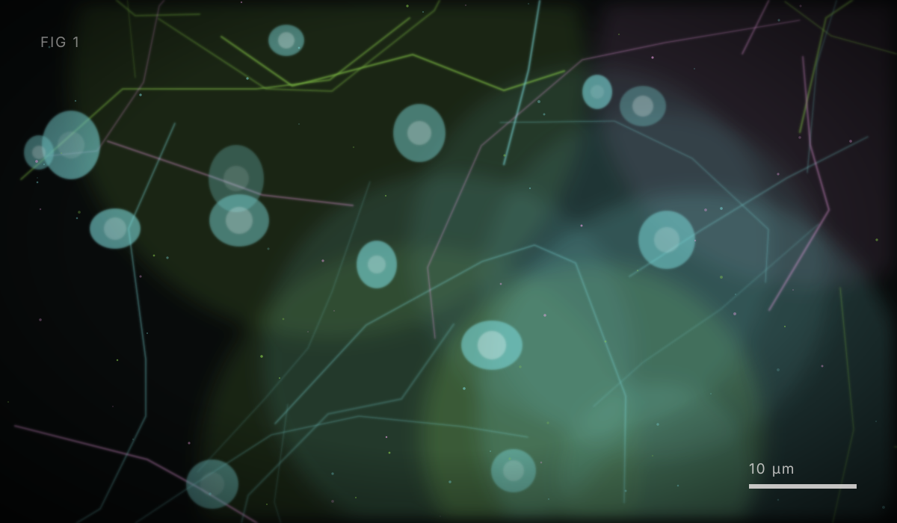
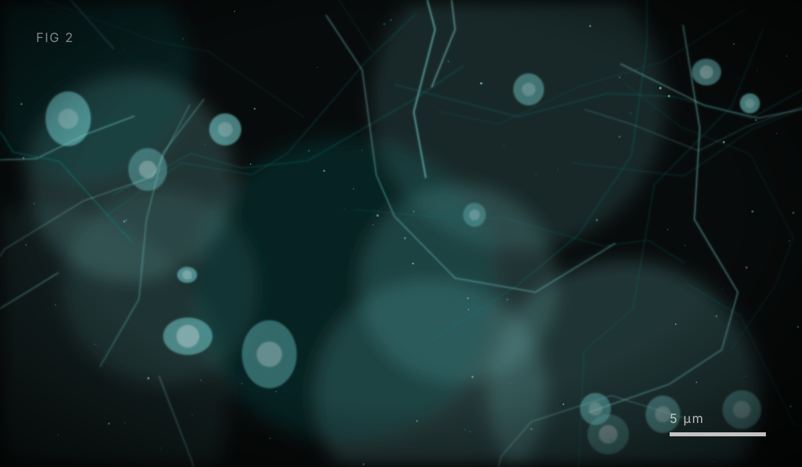

*Вступний абзац. Поясніть, про що допис і чому це важливо. Цей текст —
звичайний Markdown, тому ви можете використовувати **жирний шрифт**, *курсив*,
списки, таблиці, посилання та зображення.*

## Перший розділ

*Текст розділу. Щоб вставити зображення просто в текст, покладіть файл у теку
`blog/img/` і додайте рядок із назвою файлу — як показано нижче.*

*Продовження тексту після зображення. Зверніть увагу: текст у квадратних
дужках стає підписом під картинкою, тому пишіть у ньому щось змістовне і
без зірочок — розмітка в підписі не працює.*

## Другий розділ

*Текст другого розділу.*

- *Перший пункт списку*
- *Другий пункт*
- *Третій пункт*

### Підрозділ

*Текст підрозділу.*

| Параметр | Значення |
|----------|----------|
| *Параметр 1* | *значення* |
| *Параметр 2* | *значення* |

## Висновки

*Підсумок допису у 2–3 реченнях.*

:::note
*Тут можна залишити примітку, посилання на дані або контакт автора.*
:::

---

*Питання та зауваження надсилайте на адресу, вказану на сторінці
[Головна](about).*
