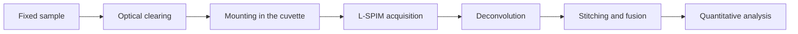
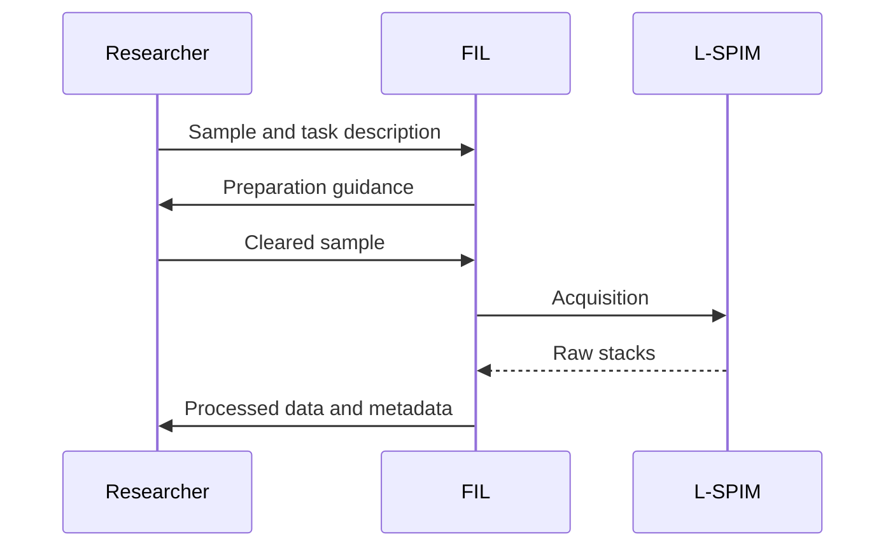

We can perform the acquisition for you, or train you to operate the system
yourself. Results are delivered in open formats together with the acquisition
metadata.

## What the Service Includes

- *List exactly what the client receives*
- *Second item*
- *Third item*

## What Is Required from the Client

| Step | Description |
|------|-------------|
| *Sample preparation* | *requirements for the preparations* |
| *Task description* | *what exactly has to be measured* |
| *Result format* | *how the data should be delivered* |

## Formulas

<!-- FORMULAS. A formula inside a line is written between single dollar signs,
     a formula on its own line between double dollar signs. -->

The thickness of the light sheet sets the optical sectioning. For a Gaussian
beam the waist $w_0$ and the Rayleigh range $z_R$ are linked as

$$
z_R = \frac{\pi w_0^2}{\lambda}
$$

so a thinner sheet buys axial resolution at the cost of the usable field of
view. The lateral resolution of the detection arm follows the usual Abbe
limit, $d = \lambda / (2\,\mathrm{NA})$, while the axial response of the
combined system is approximately

$$
d_z \approx \sqrt{d_{\text{sheet}}^2 + d_{\text{det}}^2}
$$

where $d_{\text{sheet}}$ is the sheet thickness and $d_{\text{det}}$ the axial
extent of the detection point spread function.

## Workflow

<!-- DIAGRAMS. A block that starts with three backticks and the word mermaid
     is drawn as a diagram. See README for the syntax. -->

A typical session runs in this order:

## Timeline and Pricing

*State the approximate turnaround time.* The rates are listed on the section
page — see [Equipment & Services](facility:pricing).

## How to Order

:::steps
### Write to us
Describe your research task and preferred timeline.

### Agree on the details
We clarify the sample requirements and the scope of work.

### Receive the results
Data are delivered in open formats together with a description of the processing.
:::
