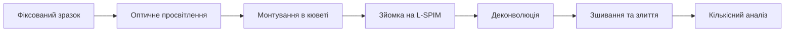
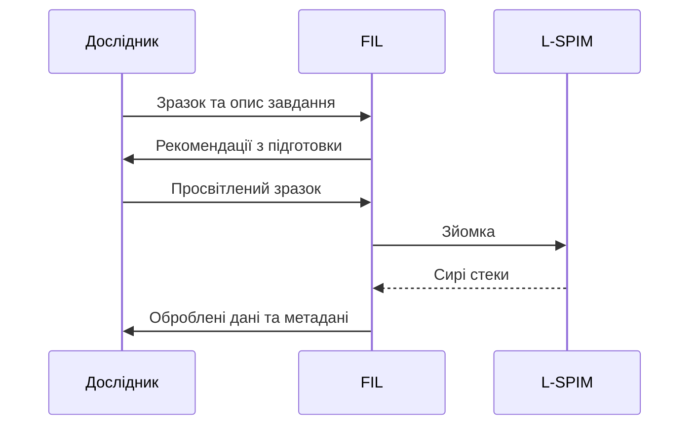

Ми проводимо зйомку самостійно або навчаємо вас працювати на системі
самостійно. Результат передається у відкритих форматах разом із метаданими
зйомки.

## Що входить до послуги

- *Перелічіть, що саме отримує замовник*
- *Другий пункт*
- *Третій пункт*

## Що потрібно від замовника

| Крок | Опис |
|------|------|
| *Підготовка зразків* | *вимоги до препаратів* |
| *Опис завдання* | *що саме потрібно виміряти* |
| *Формат результату* | *у якому вигляді передати дані* |

## Формули

<!-- ФОРМУЛИ. Формула всередині рядка пишеться між одинарними знаками долара,
     формула окремим рядком — між подвійними. -->

Товщина світлового листа визначає оптичне секціонування. Для гаусового пучка
перетяжка $w_0$ та довжина Релея $z_R$ пов'язані як

$$
z_R = \frac{\pi w_0^2}{\lambda}
$$

тож тонший лист покращує аксіальну роздільну здатність ціною корисного поля
зору. Латеральна роздільна здатність детекційного плеча визначається звичайною
межею Аббе, $d = \lambda / (2\,\mathrm{NA})$, а аксіальний відгук системи в
цілому приблизно дорівнює

$$
d_z \approx \sqrt{d_{\text{sheet}}^2 + d_{\text{det}}^2}
$$

де $d_{\text{sheet}}$ — товщина листа, а $d_{\text{det}}$ — аксіальний розмір
функції розсіювання точки детекційного плеча.

## Порядок роботи

<!-- ДІАГРАМИ. Блок, що починається з трьох зворотних лапок і слова mermaid,
     малюється як діаграма. Синтаксис описаний у README. -->

Типова сесія відбувається в такому порядку:

## Терміни та вартість

*Вкажіть орієнтовні терміни виконання.* Тарифи наведені на сторінці розділу —
див. [Обладнання та послуги](facility:pricing).

## Як замовити

:::steps
### Напишіть нам
Опишіть завдання дослідження та бажані терміни.

### Погодьте деталі
Ми уточнимо вимоги до зразків і обсяг робіт.

### Отримайте результати
Дані передаються у відкритих форматах разом із описом обробки.
:::
